# 디스코드 채팅 추출기 v2

디스코드 웹(discord.com)의 채널·DM 옆에 ⤓ 버튼을 달아 주는 크롬 확장 프로그램이에요. 버튼을 눌러 다운로드 목록에 담아 두었다가, 툴바 팝업에서 한 번에 **HTML · TXT · Markdown · Excel · CSV · JSON** 파일로 저장해요. 대화 내용은 내 컴퓨터 안에서만 처리되고, 별도 서버로는 아무것도 보내지 않아요.

<table align="center">
  <tr>
    <td align="center" valign="top">
      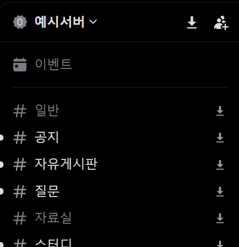
      <br>
      <sub><i>1. 디스코드에서 ⤓ 버튼을 눌러 채팅을 담아요</i></sub>
    </td>
    <td align="center" valign="top">
      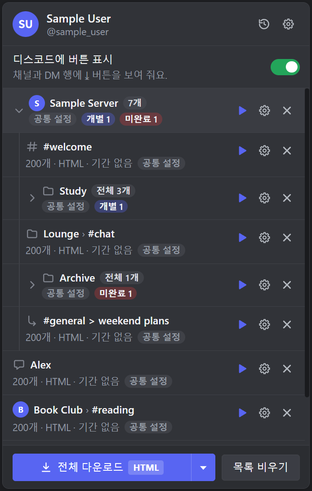
      <br>
      <sub><i>2. 팝업에서 담은 목록을 확인하고 한 번에 받아요</i></sub>
    </td>
  </tr>
</table>

### ▶ 사용 방법 영상 (약 2분)

설치부터 담기, 설정, 다운로드까지 한 번에 보여 주는 영상이에요. 자막을 따라가며 보세요. 고화질 MP4는 [릴리스 페이지](https://github.com/LanturnHouse/discord-chat-extractor-v2/releases/latest)의 Assets에서 `discord-chat-extractor-v2-usage.mp4`를 받으세요.

<p align="center">
  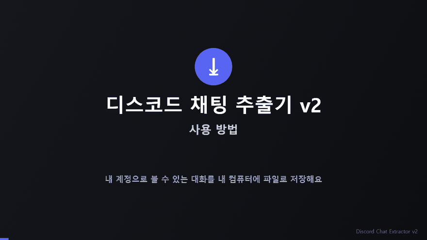
</p>

> 이 README의 화면은 예시 데이터로 찍은 것이라 이름과 숫자는 다를 수 있어요. 디스코드 화면 그림은 왼쪽 채널 목록 부분만 잘라서 넣었어요.

> 이 README는 **사용자용 설명이 먼저**이고, 개발자용 내용은 맨 뒤([14. 개발자용](#14-개발자용))에 짧게 있어요. 처음이라면 **[3. 빠른 시작](#3-빠른-시작-7단계)** 부터 보세요. 화면 문구는 실제 프로그램에 나오는 그대로 적었어요. 처음 보는 낱말은 [부록 A. 용어 설명](#부록-a-용어-설명)에, 화면이 영어로 보일 때는 [부록 B. 영어 화면 대응표](#부록-b-영어-화면-대응표)에 있어요.

> **기본값부터 알아 두세요.** 아무것도 바꾸지 않고 받으면 채팅마다 **가장 최근 메시지 200개만**, **HTML(다크 테마)** 로, **첨부파일(이미지·파일) 없이** 저장돼요. 대화 전체가 필요하면 팝업 아래쪽 **[전체 다운로드 ▾]의 ▾**를 눌러 **공통 설정**을 열고 메시지 개수를 **전체**로 바꾸세요. 이미지와 파일까지 보관하려면 **더보기 > 첨부파일 함께 저장**도 켜세요([9장](#9-설정)). 첨부를 저장하지 않으면 HTML 속 이미지는 약 24시간 뒤부터 열리지 않아요([10-5](#10-5-첨부파일과-링크-만료)).

## 목차

1. [소개와 주요 기능](#1-소개와-주요-기능)
2. [꼭 읽어 주세요: 이용약관과 계정 위험](#2-꼭-읽어-주세요-이용약관과-계정-위험)
3. [빠른 시작 (7단계)](#3-빠른-시작-7단계)
4. [요구 사항](#4-요구-사항)
5. [설치](#5-설치)
   - [5-1. 먼저, 설치 파일 구하기](#5-1-먼저-설치-파일-구하기)
   - [5-2. 방법 A: zip으로 설치 (크롬만 있으면 돼요)](#5-2-방법-a-zip으로-설치-크롬만-있으면-돼요)
   - [5-3. 방법 B: 소스에서 직접 빌드 (Node.js 필요)](#5-3-방법-b-소스에서-직접-빌드-nodejs-필요)
   - [5-4. 크롬에 불러오기](#5-4-크롬에-불러오기)
   - [5-5. 새 버전으로 업데이트](#5-5-새-버전으로-업데이트)
   - [5-6. 설치가 안 될 때](#5-6-설치가-안-될-때)
   - [5-7. zip 만들기 (파일을 나눠 주는 사람용)](#5-7-zip-만들기-파일을-나눠-주는-사람용)
6. [처음 실행](#6-처음-실행)
   - [6-1. 처음 실행 순서](#6-1-처음-실행-순서)
   - [6-2. 계정이 안 보일 때](#6-2-계정이-안-보일-때)
7. [다운로드할 채팅 고르기 (디스코드 화면)](#7-다운로드할-채팅-고르기-디스코드-화면)
   - [7-1. 버튼이 나타나는 곳](#7-1-버튼이-나타나는-곳)
   - [7-2. 아이콘 모양](#7-2-아이콘-모양)
   - [7-3. 클릭하면 어떻게 되나요](#7-3-클릭하면-어떻게-되나요)
   - [7-4. 버튼을 누르면 나오는 알림(토스트)](#7-4-버튼을-누르면-나오는-알림토스트)
   - [7-5. 단축키](#7-5-단축키)
   - [7-6. 버튼 끄기](#7-6-버튼-끄기)
8. [팝업 사용법](#8-팝업-사용법)
   - [8-1. 팝업의 생김새와 화면 이동](#8-1-팝업의-생김새와-화면-이동)
   - [8-2. 목록(트리) 읽는 법](#8-2-목록트리-읽는-법)
   - [8-3. 전체 다운로드](#8-3-전체-다운로드)
   - [8-4. 진행 상황과 취소](#8-4-진행-상황과-취소)
   - [8-5. 끝난 뒤: 완료·실패·재시도](#8-5-끝난-뒤-완료실패재시도)
   - [8-6. 툴바 배지](#8-6-툴바-배지)
   - [8-7. 완료 알림](#8-7-완료-알림)
9. [설정](#9-설정)
   - [9-1. 어디서 무엇을 바꾸나요](#9-1-어디서-무엇을-바꾸나요)
   - [9-2. 공통 설정, 서버·카테고리 설정, 개별 설정](#9-2-공통-설정-서버카테고리-설정-개별-설정)
   - [9-3. 형식 (6가지)](#9-3-형식-6가지)
   - [9-4. 메시지 개수와 기간](#9-4-메시지-개수와-기간)
   - [9-5. 더보기](#9-5-더보기)
   - [9-6. 언어와 ZIP](#9-6-언어와-zip)
   - [9-7. 앱 설정](#9-7-앱-설정)
10. [결과 파일](#10-결과-파일)
    - [10-1. 저장 위치와 이름 규칙](#10-1-저장-위치와-이름-규칙)
    - [10-2. 부분 저장: (부분)](#10-2-부분-저장-부분)
    - [10-3. ZIP 파일](#10-3-zip-파일)
    - [10-4. 형식별 파일 내용](#10-4-형식별-파일-내용)
    - [10-5. 첨부파일과 링크 만료](#10-5-첨부파일과-링크-만료)
11. [기록 화면](#11-기록-화면)
12. [문제 해결 (FAQ)](#12-문제-해결-faq)
    - [12-1. 증상으로 찾기](#12-1-증상으로-찾기) (여기서 12-2 ~ 12-22 각 항목으로 바로 갈 수 있어요)
13. [개인정보·보안 요약](#13-개인정보보안-요약)
    - [13-1. 무엇이 어디에 저장되나요](#13-1-무엇이-어디에-저장되나요)
    - [13-2. 어디와 통신하나요](#13-2-어디와-통신하나요)
    - [13-3. 크롬 권한이 필요한 이유](#13-3-크롬-권한이-필요한-이유)
14. [개발자용](#14-개발자용)
    - [14-1. 스크립트](#14-1-스크립트)
    - [14-2. 개발 자동 새로고침](#14-2-개발-자동-새로고침)
    - [14-3. 프로젝트 구조](#14-3-프로젝트-구조)
    - [14-4. 테스트](#14-4-테스트)
    - [14-5. 기여 규칙](#14-5-기여-규칙)
- [부록 A. 용어 설명](#부록-a-용어-설명)
- [부록 B. 영어 화면 대응표](#부록-b-영어-화면-대응표)

---

## 1. 소개와 주요 기능

**한 줄 소개**: 디스코드 웹에서 채널·DM 옆의 ⤓ 버튼을 눌러 목록에 담고, 팝업에서 [전체 다운로드] 한 번으로 채팅 기록을 파일로 저장하는 크롬 확장 프로그램.

사용 흐름은 세 단계예요.

1. **담기**: 디스코드 웹에서 받고 싶은 채널·DM(또는 카테고리·서버 전체) 옆의 ⤓ 버튼을 눌러요. 눌러도 디스코드 위에 설정 창은 뜨지 않고, 아이콘이 ✓로 바뀌면서 다운로드 목록에 담겨요. 다시 누르면 빠져요.
2. **확인**: 툴바의 확장 프로그램 아이콘을 눌러 팝업을 열고, 서버 ▸ 카테고리 ▸ 채널 순으로 정리된 목록과 설정(개수·기간·형식)을 확인해요.
3. **받기**: [전체 다운로드]를 누르면 다운로드 폴더에 파일이 저장돼요.

**주요 기능**

- 채널·DM·그룹 DM·스레드·포럼은 한 번 클릭으로, **카테고리·서버 전체**는 버튼 하나로 한꺼번에 담기(다시 누르면 한꺼번에 빼기)
- 저장 형식 6가지: HTML(기본, 디스코드처럼 보임) · TXT · Markdown · Excel(.xlsx) · CSV · JSON
- 메시지 **개수**(1~1,000,000개 또는 전체)와 **기간**(시작일·종료일) 지정. 둘을 함께 쓰면 "기간 안에서 최신 N개"
- 팝업의 다운로드 목록은 디스코드 사이드바처럼 **서버 ▸ 카테고리 ▸ 채널 트리**예요. 서버·카테고리 줄 하나로 그 안에 담긴 채팅을 한꺼번에 받고(▶), 설정하고(⚙), 빼요(✕). DM은 평평한 줄이에요.
- **공통 설정** 하나로 모든 채팅에 적용하고, 서버·카테고리·채팅마다 따로 설정도 가능(채팅 > 카테고리 > 서버 > 공통 순서로 적용돼요)
- 첨부파일 함께 저장(디스코드 첨부 링크는 약 24시간 뒤 만료되기 때문), 스레드·포럼 글 포함, **새 메시지만 받기**(지난번 이후)
- 봇·시스템 메시지·반응·임베드 포함 여부 선택, 파일 안의 고정 문구 언어(한국어/English) 선택
- 여러 채팅을 **ZIP 하나로** 받기
- 진행률, 취소, 툴바 배지 숫자, 완료 알림, 실패한 항목 재시도
- 다운로드 **기록**과 [다시 받기]
- 단축키 `Alt+Shift+D`로 지금 보고 있는 채팅 담기/빼기
- 디스코드 계정별로 목록·기록이 따로 보관돼요. 화면은 한국어/English를 지원해요.

---

## 2. 꼭 읽어 주세요: 이용약관과 계정 위험

> ⚠️ **주의: 이 확장 프로그램을 쓰면 디스코드 계정이 경고를 받거나 제한·정지될 수 있어요.**
> 디스코드 이용약관은 사용자 계정을 자동화된 방식으로 쓰는 것을 허용하지 않아요. 이 확장 프로그램은 내 계정의 로그인 정보로 디스코드에 대신 요청을 보내 메시지를 가져오기 때문에 여기에 해당해요. 이 위험은 **사용자 본인이 감수**해야 해요. 이 프로그램은 Discord와 아무 관련이 없는 비공식 도구예요.

- **내 대화의 개인 백업용으로만** 쓰세요. 다른 사람의 대화나 개인정보를 허락 없이 공개하거나 퍼뜨리지 마세요.
- **대량으로 받을수록 위험이 커져요.** 요청이 많을수록 디스코드가 이상하게 볼 가능성이 커져요. 필요한 채팅만 담고, 가능하면 개수 제한·기간·"새 메시지만 받기"로 요청 수를 줄이세요. 아주 긴 채널을 "전체"로 받거나 "스레드 포함"을 켜면 요청이 특히 많아져요.
- **버튼을 켜 두면 서버를 열어 보기만 해도 읽기 요청이 조금 나가요.** 디스코드 화면에 ⤓ 버튼이 켜져 있는 동안 서버 화면을 열면, 카테고리·서버 버튼의 ✓ 표시를 계산하려고 그 서버의 채널 목록, 역할, 서버 정보, 내 멤버 정보를 읽는 요청이 몇 건 자동으로 나가요(같은 서버는 탭마다 약 5분에 한 번 꼴이고, 디스코드 서버에는 읽기 요청만 가요). 이게 걱정되면 팝업의 **디스코드에 버튼 표시**를 끄고 단축키 `Alt+Shift+D`로 채팅을 담으세요. 이 스위치를 꺼도 "지금 어느 계정으로 로그인했는지" 확인하는 요청(1건)은 새 로그인 정보가 잡혔을 때 등에 가끔 그대로 나가요.
- 잃으면 곤란한 계정이라면 쓰지 않는 것을 권해요.
- 프로그램은 위험을 줄이려고 요청을 **천천히, 하나씩** 보내요(메시지 요청 사이에 0.7~1.5초, 채팅 사이에 2~4초 간격, 디스코드가 속도를 제한하면 그만큼 기다림). 그래도 위험이 0이 되는 것은 아니에요.
- **데이터는 내 컴퓨터에만 있어요.** 가져온 대화는 이 브라우저 안에서 바로 파일로 만들어 저장해요. 별도 서버·분석 도구·원격 코드가 없어요.
- **로그인 정보(토큰)는 브라우저 밖으로 나가지 않아요.** 디스코드 서버(discord.com)에 요청을 보낼 때만 쓰고, 파일·기록·로그에는 남기지 않아요. (토큰이 무엇인지는 [부록 A](#부록-a-용어-설명), 자세한 내용은 [13. 개인정보·보안 요약](#13-개인정보보안-요약)에 있어요.)

처음 팝업을 열면 이 내용이 안내 화면으로 한 번 더 나오고, [동의하고 시작]을 눌러야 다운로드할 수 있어요([6장](#6-처음-실행)).

---

## 3. 빠른 시작 (7단계)

처음 쓰는 분을 위한 가장 짧은 순서예요. 각 단계의 자세한 설명은 괄호 안의 장에 있어요.

1. **설치 파일을 구하고 설치해요.** [릴리스 페이지](https://github.com/LanturnHouse/discord-chat-extractor-v2/releases/latest)에서 zip 파일을 받아 새 폴더에 풀고, 크롬의 `chrome://extensions`에서 **개발자 모드**를 켠 뒤 **압축해제된 확장 프로그램을 로드합니다**로 그 폴더를 골라요. (zip이 아니라 프로젝트 폴더를 받았다면 Node.js로 빌드한 `dist` 폴더를 골라요.) ([5장](#5-설치))
2. **크롬에서 디스코드 웹(https://discord.com)을 열고 로그인해요.** 이미 열어 둔 디스코드 탭이 있으면 F5로 새로고침해요.
3. **툴바의 확장 프로그램 아이콘을 눌러 안내를 읽고 [동의하고 시작]을 눌러요.** ([6장](#6-처음-실행))
4. **디스코드의 채널·DM 줄 맨 오른쪽 ⤓ 버튼을 눌러요.** 아이콘이 ✓로 바뀌면 다운로드 목록에 담긴 거예요. ([7장](#7-다운로드할-채팅-고르기-디스코드-화면))

<p align="center">
  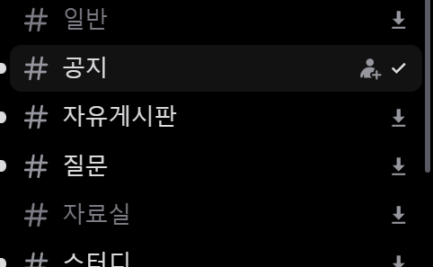
  <br>
  <i>4단계: 담으면 맨 오른쪽의 ⤓가 ✓로 바뀌어요. (마우스를 올리면 디스코드의 초대 아이콘이 왼쪽에 나타나지만 우리 버튼은 제자리예요.)</i>
</p>

5. **받는 범위를 정해요.** 툴바 아이콘을 눌러 목록을 확인하고, 기본값(**최신 200개만, 첨부 없이, HTML**)이 괜찮은지 봐요. 대화 전체나 이미지·파일이 필요하면 **[전체 다운로드 ▾]의 ▾**로 **공통 설정**을 열어 바꿔요. 서버·카테고리·채팅마다 따로 정하고 싶으면 그 줄의 ⚙를 눌러요. ([9장](#9-설정))
6. **팝업 아래쪽 [전체 다운로드]를 눌러요.** 진행률이 보이고, 끝나면 목록에서 사라져요. 팝업을 닫아도 다운로드는 계속돼요. ([8장](#8-팝업-사용법))

<p align="center">
  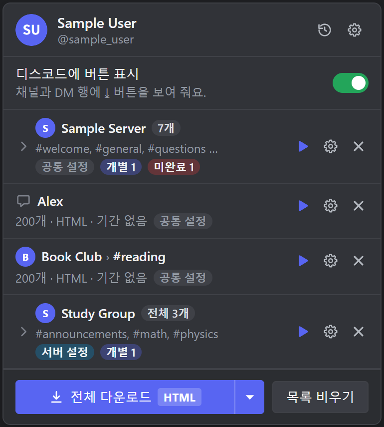
  <br>
  <i>5~6단계: 목록과 설정 요약(예: 200개 · HTML · 기간 없음)을 확인하고, 맨 아래 [전체 다운로드]를 눌러요.</i>
</p>

7. **다운로드 폴더 안의 `Discord Export` 폴더에서 파일을 열어요.** 알림이나 팝업의 [폴더 열기]로도 갈 수 있어요. ([10장](#10-결과-파일))

> 막히면 [12. 문제 해결](#12-문제-해결-faq)의 "증상으로 찾기" 표를 보세요.

---

## 4. 요구 사항

| 항목 | 내용 |
|---|---|
| 브라우저 | **Chrome 120 이상** (매니페스트의 `minimum_chrome_version`). Chrome만 확인했어요. Edge·Whale·Brave 같은 다른 Chromium 계열 브라우저는 시험하지 않았고 지원하지 않아요(`chrome://` 주소도 브라우저마다 달라요). 버전은 `chrome://settings/help`에서 확인하고 업데이트할 수 있어요. |
| 운영체제 | Windows, macOS. 개발과 시험은 Windows에서 했고, **macOS는 직접 확인하지 못했어요**(코드는 특정 운영체제에 매이지 않아요). |
| 디스코드 | **웹 버전**(discord.com, ptb.discord.com, canary.discord.com)에 로그인되어 있어야 해요. 디스코드 데스크톱 앱에서는 쓸 수 없어요. |
| Node.js·npm | **직접 빌드할 때만** 필요해요([5-3](#5-3-방법-b-소스에서-직접-빌드-nodejs-필요)). **Node.js LTS(22 또는 24)** 를 권장해요(빌드 최소 요건은 Node.js 20.19 이상 또는 22.12 이상이고, npm은 Node.js와 함께 설치돼요). 미리 만든 zip을 받았다면 필요 없어요. 테스트까지 돌리는 개발자용 요건은 [14장](#14-개발자용)에 있어요. |

---

## 5. 설치

이 README는 크롬 웹 스토어를 거치지 않고 **압축해제된 확장 프로그램**으로 설치하는 방법을 설명해요. 크롬이 설치 파일(폴더)을 직접 읽는 방식이라, 설치한 폴더를 지우거나 옮기면 확장 프로그램이 멈춰요.

### 5-1. 먼저, 설치 파일 구하기

가장 쉬운 방법은 GitHub **릴리스 페이지**에서 설치용 zip을 받는 거예요.

1. 브라우저로 **https://github.com/LanturnHouse/discord-chat-extractor-v2/releases/latest** 를 열어요.
2. 아래쪽 **Assets** 목록에서 `discord-chat-extractor-v2-<버전>.zip` 을 눌러 내려받아요. (`Source code` 로 시작하는 파일이 아니에요.)
3. 받은 zip으로 [5-2. 방법 A](#5-2-방법-a-zip으로-설치-크롬만-있으면-돼요)를 따라 설치해요.

설치 파일을 다른 곳에서 받았다면 받은 것에 따라 방법이 달라요.

| 받은 것 | 필요한 것 | 방법 |
|---|---|---|
| zip 파일 (릴리스 페이지에서 받은 `discord-chat-extractor-v2-2.0.0.zip` 같은 이름) | 크롬만 | [5-2. 방법 A](#5-2-방법-a-zip으로-설치-크롬만-있으면-돼요) (가장 쉬워요) |
| 이미 빌드된 `dist` 폴더 (안에 `manifest.json`이 바로 있어요) | 크롬만 | [5-4. 크롬에 불러오기](#5-4-크롬에-불러오기)에서 그 폴더를 바로 고르세요 |
| 프로젝트 폴더 (`package.json`, `src` 폴더가 들어 있어요) | 크롬 + Node.js | [5-3. 방법 B](#5-3-방법-b-소스에서-직접-빌드-nodejs-필요) |

직접 zip을 만들어 나눠 주려면 [5-7](#5-7-zip-만들기-파일을-나눠-주는-사람용)을 보세요.

### 5-2. 방법 A: zip으로 설치 (크롬만 있으면 돼요)

1. **새 빈 폴더**를 만들어요. 오래 둘 곳이 좋아요(예: `문서\discord-chat-extractor-v2`).
2. zip을 **그 빈 폴더 안에 풀어요.** 이 zip은 파일들이 겉 폴더 없이 `manifest.json`부터 바로 들어 있어요. 그래서 반디집·7-Zip의 **"여기에 풀기"** 를 쓰면 지금 있는 폴더(예: 다운로드 폴더)에 파일이 흩어져 버려요. 꼭 빈 폴더를 만들어 그 안에 푸세요.
3. 푼 폴더를 열어 **바로 아래에 `manifest.json`이 보이는지** 확인해요. 폴더가 한 겹 더 들어가 있으면 안쪽 폴더를 쓰세요.
4. [5-4. 크롬에 불러오기](#5-4-크롬에-불러오기)로 가서 그 폴더를 골라요.

### 5-3. 방법 B: 소스에서 직접 빌드 (Node.js 필요)

**빌드**란 프로젝트의 소스 코드를 크롬이 읽을 수 있는 확장 프로그램 파일로 만드는 작업이에요. 결과는 프로젝트 안의 `dist` 폴더에 만들어져요.

**① Node.js 설치**

1. https://nodejs.org 에서 **LTS** 설치 파일(22 또는 24)을 받아 설치해요. 설치 중 옵션은 기본값 그대로 두면 돼요. npm은 함께 설치돼요.
2. 설치 전에 열어 둔 터미널이 있으면 **닫고 새로 열어요.** 그래야 방금 설치한 프로그램을 찾아요.
3. 터미널에서 `node -v`를 입력해요. `v22.…`나 `v24.…`처럼 버전이 나오면 준비 끝이에요. 버전이 `v20.19` 이상이거나 `v22.12` 이상이면 빌드는 돼요.

**② 프로젝트 폴더에서 터미널 열기**

- **Windows**: 탐색기에서 프로젝트 폴더(`package.json`이 있는 폴더)를 열어요. 위쪽 주소 칸을 클릭해 `cmd`를 입력하고 Enter를 누르면 그 폴더에서 명령 프롬프트가 열려요. PowerShell이 아니라 **명령 프롬프트**를 쓰는 것을 권해요([5-6](#5-6-설치가-안-될-때) 참고).
- **macOS**: 터미널 앱을 열고 `cd ` (뒤에 공백 한 칸)를 입력한 뒤, Finder에서 프로젝트 폴더를 터미널 창으로 끌어다 놓고 Enter를 눌러요.

**③ 빌드하기** (인터넷 연결이 필요해요)

```bash
npm ci          # 필요한 패키지를 package-lock.json 그대로 내려받아 설치 (몇 분 걸리고, 디스크를 약 150MB 써요)
npm run build   # 타입 검사 + 빌드. 결과는 dist 폴더에 만들어져요
```

오류 메시지 없이 입력 줄로 돌아오고 프로젝트 안에 **`dist` 폴더**가 생기면 성공이에요. `dist` 안에 `manifest.json`이 바로 있고, 크기는 약 10MB예요.

**④** [5-4. 크롬에 불러오기](#5-4-크롬에-불러오기)로 가서 **`dist` 폴더**를 골라요.

> `npm run dev`를 한 적이 있다면 `dist`에 **개발용 빌드**가 남아 있어요. 평소에 쓸 때는 `npm run build`로 다시 만들어 주세요(개발용 빌드는 개발 서버 주소 `localhost:5858`에 접근할 수 있는 권한까지 들어 있어요).

### 5-4. 크롬에 불러오기

zip을 푼 폴더나 `dist` 폴더가 준비되면 크롬에서 이렇게 해요.

1. 주소창에 `chrome://extensions`를 입력해 열어요.
2. 오른쪽 위의 **개발자 모드**를 켜요.
3. **압축해제된 확장 프로그램을 로드합니다**를 눌러요.
4. **`manifest.json`이 바로 들어 있는 폴더**(zip을 푼 폴더 또는 `dist` 폴더)를 선택해요. 프로젝트 맨 위 폴더나 zip 파일을 고르면 안 돼요.
5. 목록에 **디스코드 채팅 추출기 v2** 카드가 생겼고 켜져 있는지 확인해요. 카드에 버전 `2.0.0`이 보여요.
6. 툴바의 퍼즐 조각 아이콘을 눌러 **디스코드 채팅 추출기 v2**의 핀을 눌러 툴바에 고정해요.
7. 이미 열어 둔 디스코드 탭이 있으면 **새로고침(F5)** 해요.

`chrome://extensions` 화면에서 누를 곳은 대략 이래요. 크롬 버전에 따라 모양과 배치가 조금 달라요.

```text
chrome://extensions
  확장 프로그램 ........................................ 개발자 모드 [ 켬 ]   <- 2번: 오른쪽 위 스위치
  [압축해제된 확장 프로그램을 로드합니다]  [확장 프로그램 압축]  [업데이트]
        ^ 3번: 개발자 모드를 켜면 나타나는 버튼이에요. 눌러서 manifest.json이 있는 폴더를 골라요.

  +----------------------------------------------------------+
  | 디스코드 채팅 추출기 v2   2.0.0                            |   <- 5번: 이 카드가 보이면 성공
  | [세부정보]  [삭제]                      새로고침(⟳) (켜짐) |   <- 업데이트할 때는 ⟳를 눌러요(5-5)
  +----------------------------------------------------------+
```

> - 크롬 표시 언어가 한국어가 아니라 영어이면 카드 이름과 툴바 아이콘의 말풍선이 **Discord Chat Extractor v2** 로 보여요. 같은 확장 프로그램이에요.
> - 폴더를 지우거나 옮기면 확장 프로그램이 멈춰요(크롬이 그 폴더를 직접 읽어요). 한곳에 두세요.
> - 크롬을 켤 때 "개발자 모드 확장 프로그램을 사용 중지하세요" 같은 안내가 뜰 수 있는데, 그냥 닫으면 돼요.

### 5-5. 새 버전으로 업데이트

1. **새 파일 준비**
   - **zip으로 설치한 경우**: 새 zip을 받아, **지금 쓰는 폴더 안의 파일을 모두 지운 뒤**(폴더 자체는 그대로 두세요) 그 폴더에 새 zip을 풀어요. 그냥 덮어 풀기만 하면 예전 버전의 파일 조각이 남을 수 있어요.
   - **소스로 설치한 경우**: 새 소스 폴더를 받아 기존 폴더를 바꾸고(또는 덮어쓰고), `npm ci` 후 `npm run build`를 실행해요(`package-lock.json`이 그대로라면 `npm run build`만 해도 돼요).
2. `chrome://extensions`에서 **디스코드 채팅 추출기 v2** 카드의 **새로고침(⟳) 버튼**을 눌러요.
3. 열려 있는 **디스코드 탭을 새로고침(F5)** 해요. 확장 프로그램을 새로고침하면 열려 있던 디스코드 탭의 예전 버튼은 연결이 끊기고, 메모리에만 있던 로그인 확인 정보도 지워지기 때문이에요. 탭을 새로고침하면 버튼이 다시 붙고 계정도 다시 확인돼요.

> **같은 폴더 경로를 계속 쓰세요.** 압축해제된 확장 프로그램은 폴더 경로로 구분되기 때문에, **다른 폴더에서 새로 로드하면 다른 확장 프로그램으로 취급되어** 목록·기록·설정이 비어 있는 상태로 시작해요.

### 5-6. 설치가 안 될 때

| 증상 | 원인과 해결 |
|---|---|
| `node`나 `npm`을 찾을 수 없다는 오류 | Node.js가 설치되지 않았거나, 설치 전에 열어 둔 터미널을 그대로 쓰고 있어요. Node.js를 설치하고 **터미널을 닫았다가 새로 열어** 다시 해 보세요. |
| Windows PowerShell에서 `npm.ps1`을 실행할 수 없다는 오류 ("이 시스템에서 스크립트를 실행할 수 없으므로 …") | PowerShell의 보안 설정 때문이에요. **시스템 설정을 바꾸지 말고** **명령 프롬프트(cmd)** 에서 같은 명령을 실행하거나, PowerShell에서 `npm.cmd ci`, `npm.cmd run build`처럼 `npm.cmd`로 실행하세요. |
| `npm ci`나 `npm run build`가 Node.js 버전이 낮다는 오류를 내요 | `node -v`로 버전을 확인하고 Node.js LTS(22 또는 24)로 업그레이드하세요. 그 뒤 터미널을 새로 열어요. |
| `npm ci`가 네트워크 오류로 멈춰요 | 인터넷 연결이 필요해요. 회사·학교 네트워크가 npm 접속을 막을 수 있어요. 다른 네트워크에서 해 보세요. |
| 크롬이 "매니페스트 파일이 없거나 읽을 수 없습니다"(영어: Manifest file is missing or unreadable) 같은 오류를 내요 | `manifest.json`이 **바로 들어 있지 않은** 폴더를 골랐어요(프로젝트 맨 위 폴더, zip 파일, 한 겹 바깥/안쪽 폴더). [5-4](#5-4-크롬에-불러오기)의 4번대로 `manifest.json`이 바로 보이는 폴더를 고르세요. |
| 크롬이 확장 프로그램을 불러오지 못하고 버전 오류를 내요 | Chrome이 120보다 오래됐어요. `chrome://settings/help`에서 크롬을 업데이트하세요. |
| **개발자 모드** 스위치가 없거나 눌러지지 않아요 | 회사·학교가 관리하는 크롬이라 관리자가 막아 두었을 수 있어요. 관리자에게 문의하세요(스스로 정책을 바꾸려 하지 마세요). |
| 확장 프로그램 카드에 오류가 뜨거나 갑자기 꺼졌어요 | 설치한 폴더를 지우거나 옮기지 않았는지 확인하고, 카드의 새로고침(⟳)을 눌러 보세요. 그래도 같으면 오류 문구를 메모해 [12-22](#12-22-그래도-해결이-안-되면)를 보세요. |

### 5-7. zip 만들기 (파일을 나눠 주는 사람용)

빌드가 가능한 PC(Node.js 설치됨)에서 프로젝트 폴더의 터미널로 아래를 실행해요.

```bash
npm ci
npm run build
npm run pack    # 프로젝트 폴더에 discord-chat-extractor-v2-2.0.0.zip 이 생겨요
```

`npm run pack`은 빌드를 해 주지 않아요. 먼저 `npm run build`를 실행해야 해요. `pack`은 `dist`를 검사한 뒤 압축하고, 개발용 빌드이면 거부해요. zip 파일 이름의 `2.0.0`은 `package.json`의 버전이에요. zip 안에는 `dist`의 **내용물**이 겉 폴더 없이 들어가므로, 받는 사람이 "여기에 풀기"를 쓰면 파일이 흩어져요. 받는 사람에게 **빈 폴더에 풀라고** 알려 주세요([5-2](#5-2-방법-a-zip으로-설치-크롬만-있으면-돼요)).

---

## 6. 처음 실행

### 6-1. 처음 실행 순서

1. 크롬에서 디스코드 웹(https://discord.com)을 열고 **로그인**해요.
2. 툴바의 **디스코드 채팅 추출기 v2** 아이콘을 눌러 팝업을 열어요. (핀을 하지 않았다면 퍼즐 조각 아이콘 안에 있어요.)
3. 첫 실행에는 **"시작하기 전에 꼭 읽어 주세요"** 안내가 나와요. 네 가지 안내(디스코드 이용약관과 계정 위험 / 내 대화의 개인 백업용으로만 쓰세요 / 데이터는 이 컴퓨터에만 있어요 / 천천히, 조금씩 받아요)를 읽고 **[동의하고 시작]**을 눌러요. 동의하기 전에는 다운로드할 수 없어요. 이 안내 화면에는 기록·설정 아이콘이 없어요. 동의해야 일반 화면이 열려요. 나중에 다시 보려면 팝업의 설정(⚙) → [약관·위험 안내 다시 보기]예요.

<p align="center">
  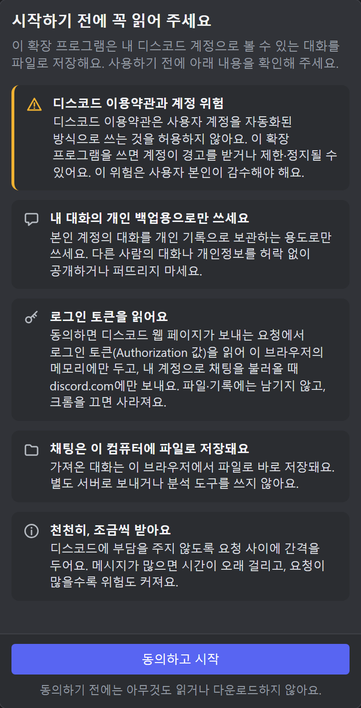
  <br>
  <i>3단계: 네 가지 안내를 읽고 맨 아래 [동의하고 시작]을 눌러요. 이 화면에는 기록·설정 아이콘이 없어요.</i>
</p>

4. 메인 화면이 열려요. 맨 위 **헤더**에는 지금 확인된 **디스코드 계정**이 나와요. 프로필 사진, 표시 이름, 그 아래 `@아이디`예요. 오른쪽에는 시계 모양의 **기록** 아이콘과 톱니 모양의 **설정** 아이콘이 있어요(마우스를 올리면 이름이 나와요). 이 두 아이콘은 동의한 뒤에만 보여요.
5. 이제 디스코드 화면으로 가서 채팅을 골라요([7장](#7-다운로드할-채팅-고르기-디스코드-화면)).

> 화면 문구는 기본적으로 **디스코드 화면 언어**를 따라가요(한국어 또는 영어). 바꾸려면 [9-6. 언어와 ZIP](#9-6-언어와-zip)을 보세요.

### 6-2. 계정이 안 보일 때

팝업 헤더 아래에 안내 줄이 뜨면 아래 표를 보세요. 이 안내 줄은 **계정을 아직 모를 때**(또는 연결·버튼 문제가 있을 때) 나타나요.

<p align="center">
  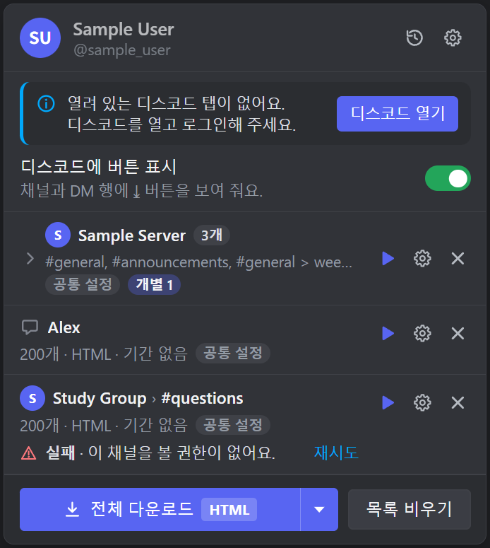
  <br>
  <i>디스코드 탭이 없을 때: 위쪽 안내 줄의 [디스코드 열기]를 눌러요. 헤더의 계정이 흐리게 보이는 건 마지막으로 확인한 계정이라는 뜻이에요.</i>
</p>

목록 맨 아래의 "실패 · …" 줄과 [재시도]는 이 안내 줄과 상관없이 실패한 채팅에 붙는 표시예요([8-5](#8-5-끝난-뒤-완료실패재시도)).

| 안내 문구 | 뜻 | 할 일 |
|---|---|---|
| 열려 있는 디스코드 탭이 없어요. 디스코드를 열고 로그인해 주세요. **[디스코드 열기]** | 디스코드 탭이 하나도 없고 계정도 모르는 상태예요. | [디스코드 열기]를 누르면 열려 있는 탭으로 이동하고, 없으면 새 탭으로 디스코드를 열어요. 로그인되어 있는지 확인하세요. |
| 계정 확인 중… (디스코드 탭에서 로그인한 계정을 확인하고 있어요.) | 디스코드 탭은 있는데 아직 계정을 확인하지 못했어요. 보통 몇 초면 끝나요. | 잠시 기다려 보고, 계속 그대로면 **디스코드 탭을 새로고침(F5)** 하세요. 안 풀리면 [12-3](#12-3-계정-확인-중이-계속-떠-있어요)을 보세요. |
| 디스코드 로그인 정보가 만료됐어요. 디스코드 탭을 새로고침한 뒤 다시 시도해 주세요. | 다운로드 중 디스코드가 로그인 정보를 거부했어요(로그아웃·비밀번호 변경 등). | 디스코드 탭을 새로고침하고(필요하면 다시 로그인) 다시 시도하세요. |
| 디스코드 화면에 버튼을 붙이지 못했어요. 디스코드가 업데이트되어 화면 구조가 바뀐 것 같아요. | 디스코드 화면이 바뀌어서 ⤓ 버튼을 붙이지 못했어요. 괄호 안에 이유가 덧붙을 수 있어요. | [12-2](#12-2-버튼이-디스코드-화면에-안-보여요)를 보세요. |
| 확장 프로그램의 백그라운드와 연결하지 못했어요. 팝업을 닫고 다시 열어 보세요. | 팝업이 확장 프로그램 본체와 통신하지 못했어요. | 팝업을 닫고 다시 여세요. 계속되면 확장 프로그램을 새로고침하세요. |

계정을 아직 모를 때 헤더에는 "계정을 확인하지 못했어요 / 디스코드에 로그인하면 여기에 표시돼요"가 나와요. 예전에 확인한 계정이 있으면 흐리게 보여 주고(마우스를 올리면 "마지막으로 확인한 계정이에요"), 새로 확인될 때까지 다운로드는 시작할 수 없어요.

---

## 7. 다운로드할 채팅 고르기 (디스코드 화면)

### 7-1. 버튼이 나타나는 곳

버튼은 **항상 보여요**(마우스를 올릴 필요가 없어요). 디스코드가 마우스를 올릴 때만 보여 주는 아이콘(초대하기·채널 편집·채널 만들기 등)은 우리 버튼의 **왼쪽**에 나타나므로, 마우스를 올려도 우리 버튼은 움직이지 않아요.

> 팝업의 목록이 비어 있을 때 "디스코드에서 채널이나 DM에 마우스를 올리고 ⤓ 버튼을 누르세요"라는 안내가 나와요. 문구에는 "마우스를 올리고"라고 되어 있지만, 지금은 버튼이 항상 보이므로 **마우스를 올려 볼 필요가 없어요.**

디스코드 왼쪽 채널 목록은 아래처럼 보여요(디스코드 버전과 테마에 따라 조금 달라요). ⤓가 이 확장 프로그램의 버튼이에요.

<p align="center">
  
  <br>
  <i>서버 이름 줄에서는 초대(사람+) 아이콘 바로 왼쪽의 ⤓가 서버 버튼이고, 채널 줄에서는 맨 오른쪽의 ⤓가 채널 버튼이에요.</i>
</p>

카테고리 줄과 DM 줄에도 같은 버튼이 있어요. 줄마다 버튼 위치는 아래 표와 같고, 카테고리 줄은 [7-3](#7-3-클릭하면-어떻게-되나요)의 그림, DM 줄은 표 아래의 그림에서 볼 수 있어요.

| 어디 | 버튼 위치 | 누르면 |
|---|---|---|
| 서버의 **채널 줄** (채널 이름이 있는 한 줄: 텍스트·공지·포럼·음성 등) | 채널 이름 줄의 **맨 오른쪽** | 그 채널 하나를 담기/빼기 |
| **스레드 줄** | 줄의 맨 오른쪽 | 그 스레드 하나를 담기/빼기 |
| **DM 줄** (왼쪽 다이렉트 메시지 목록, 그룹 DM 포함) | 줄의 맨 오른쪽 (디스코드의 닫기 X 버튼 오른쪽) | 그 DM 하나를 담기/빼기 |
| **카테고리 줄** | 카테고리 이름 줄의 맨 오른쪽 | 그 카테고리에서 내가 볼 수 있는 채널 전부 |
| **서버 이름 헤더** (채널 목록 맨 위) | 서버 이름 오른쪽, **사람+ 모양 "서버에 초대하기" 아이콘 바로 왼쪽** | 그 서버에서 내가 볼 수 있는 채널 전부 |

- ⚠️ **DM 줄에서는 디스코드의 X 버튼이 우리 ⤓ 바로 왼쪽에 붙어요.** X는 디스코드 자체의 버튼으로, 마우스를 올리면 나타나서 대화를 목록에서 닫아요(그룹 DM에서는 그룹 나가기 확인 창이 열려요). 우리 버튼은 **가장 오른쪽 아이콘**이에요. 헷갈리지 않게 눌러 보기 전에 말풍선을 확인하세요.

<table align="center">
  <tr>
    <td align="center" valign="top">
      
      <br>
      <i>평소: 줄 맨 오른쪽에 ⤓만 보여요.</i>
    </td>
    <td align="center" valign="top">
      
      <br>
      <i>마우스를 올리면: 디스코드의 ✕(닫기)가 ⤓ 왼쪽에 나타나요. 우리 버튼은 가장 오른쪽이에요.</i>
    </td>
  </tr>
</table>

- 서버에서 초대 권한이 없어 초대 아이콘이 없으면 서버 버튼은 헤더 오른쪽 끝에 붙어요. DM 홈(`/channels/@me`)에는 서버 헤더가 없어서 서버 버튼도 없어요.
- 버튼은 **화면에 보이는 줄**에만 붙어요. 디스코드가 화면 밖의 줄을 지우기 때문에, 접힌 카테고리 안의 채널은 펼치거나 스크롤해서 보여야 버튼이 보여요(카테고리 버튼으로는 접힌 채로도 담을 수 있어요).
- 마우스를 버튼에 올리거나 키보드로 포커스를 주면 말풍선이 떠요. 키보드로는 포커스를 준 뒤 Enter 또는 Space를 누르면 눌러져요.

### 7-2. 아이콘 모양

| 아이콘 | 뜻 |
|---|---|
| **⤓** (아래 화살표 + 받침선) | 아직 목록에 없어요. 누르면 담아요. |
| **✓** (체크) | 이미 목록에 있어요. 누르면 빼요. |
| **✕** (엑스) | ✓ 버튼에 마우스를 올리거나 키보드로 포커스를 주면 ✓가 ✕로 바뀌어요. "누르면 목록에서 빠져요"라는 뜻이에요(말풍선 문구는 그대로예요). 채널·DM·카테고리·서버 버튼이 모두 같아요. 방금 눌러서 담은 직후에는 ✕로 바뀌지 않고, 마우스를 치우거나 포커스를 잃을 때까지(길어도 약 8초) ✓가 그대로 보여요. |

⤓는 위의 서버 헤더 그림에서 볼 수 있고, ✓와 ✕는 이렇게 보여요.

<table align="center">
  <tr>
    <td align="center" valign="top">
      
      <br>
      <i>✓: 이미 목록에 담긴 채널이에요. (초대 아이콘은 디스코드의 것이에요.)</i>
    </td>
    <td align="center" valign="top">
      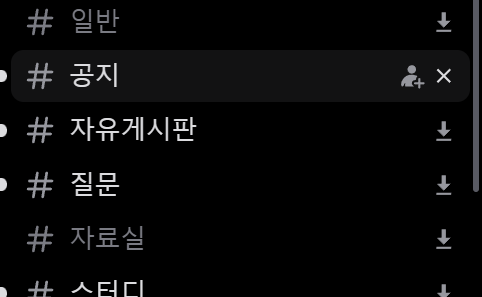
      <br>
      <i>✕: ✓ 버튼에 마우스를 올린 모습이에요. 누르면 목록에서 빠져요.</i>
    </td>
  </tr>
</table>

카테고리·서버 버튼은 그 그룹에서 **내가 볼 수 있는 채널이 전부** 목록에 있을 때만 ✓이고, 하나라도 빠져 있으면 ⤓예요. 어떤 채널이 "볼 수 있는" 채널인지는 디스코드에서 그 서버를 열었을 때 확장 프로그램이 기록해 두는 정보로 판단하므로, 서버를 연 직후나 그 정보를 가져오지 못했을 때는 ⤓로 보일 수 있어요.

말풍선 문구:

| 버튼 | ⤓일 때 | ✓일 때 |
|---|---|---|
| 채널·스레드·DM | 다운로드 목록에 추가 | 다운로드 목록에서 빼기 |
| 카테고리 | 이 카테고리 채널 전부 추가 | 이 카테고리 채널 전부 빼기 |
| 서버 | 이 서버 채널 전부 추가 | 이 서버 채널 전부 빼기 |

### 7-3. 클릭하면 어떻게 되나요

버튼은 **토글**(누를 때마다 켜졌다 꺼지는 스위치)이에요.

- **채널·스레드·DM 버튼**: ⤓를 누르면 목록에 담기고 ✓로 바뀌어요. ✓를 다시 누르면 목록에서 빠져요.
- **카테고리·서버 버튼**:
  - 볼 수 있는 채널이 **전부 이미 목록에 있으면** → 그 채널들을 전부 **뺍니다**(개별 설정을 한 채널도 함께 빠져요).
  - 하나라도 빠져 있으면 → **빠진 채널만** 추가해요. 이미 담긴 채널은 그대로 두어요.
  - 담기는 채널은 **텍스트·공지·포럼·미디어 채널** 중 내가 볼 수 있는 것이에요(역할과 채널 권한으로 계산). 음성 채널과 스레드는 포함되지 않아요(필요하면 그 줄의 버튼으로 하나씩 담으세요).
  - 권한 정보를 디스코드에서 가져오지 못하면 권한 필터 없이 모든 채널이 담길 수 있어요. 그중 읽을 수 없는 채널은 다운로드할 때 "이 채널을 볼 권한이 없어요"로 실패해요.

<table align="center">
  <tr>
    <td align="center" valign="top">
      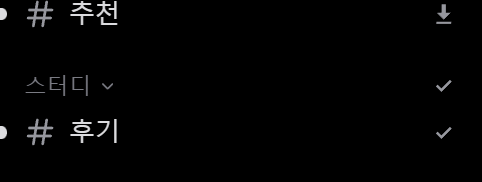
      <br>
      <i>카테고리 버튼을 누른 뒤: 카테고리 줄과 그 안의 채널 줄이 모두 ✓예요. 카테고리 밖의 채널은 ⤓ 그대로예요.</i>
    </td>
    <td align="center" valign="top">
      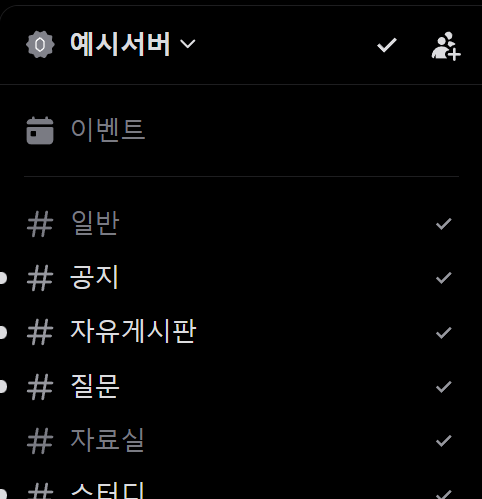
      <br>
      <i>서버 버튼을 누른 뒤: 서버 버튼과 채널 줄이 모두 ✓로 바뀌어요.</i>
    </td>
  </tr>
</table>

- 이렇게 담긴 항목에는 **따로 정한 설정이 없어요.** 위쪽 설정을 따라가요. 그 서버나 카테고리에 **서버·카테고리 설정**을 정해 두었다면 그 설정을, 없다면 **공통 설정**을 써요. 나중에 그 설정을 바꾸면 같이 바뀌고, 채팅마다 따로 바꾸려면 팝업에서 그 줄의 ⚙를 쓰세요([9-2](#9-2-공통-설정-서버카테고리-설정-개별-설정)).
- 팝업의 목록에서는 담은 채널이 **자동으로 소속 서버·카테고리 아래에 묶여** 보여요. 채널을 하나씩 담아도 마찬가지예요([8-2](#8-2-목록트리-읽는-법)).
- 담기는 항목은 디스코드 계정별 목록에 저장돼요. 팝업을 열지 않아도 유지돼요.

### 7-4. 버튼을 누르면 나오는 알림(토스트)

**토스트**는 화면 아래 가운데에 2.5초 동안 떠 있다 사라지는 작은 알림이에요.

<p align="center">
  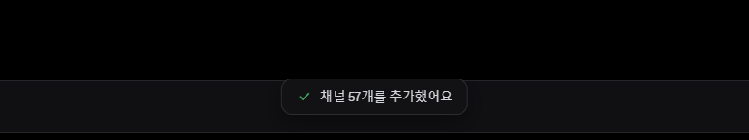
  <br>
  <i>카테고리·서버 버튼으로 여러 채널을 한꺼번에 담으면 몇 개를 담았는지 알려 줘요.</i>
</p>

<p align="center">
  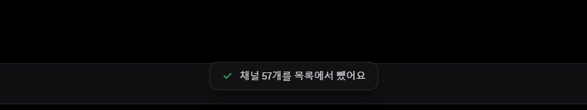
  <br>
  <i>✓가 된 카테고리·서버 버튼을 다시 누르면 뺀 개수를 알려 줘요.</i>
</p>

| 알림 문구 | 언제 |
|---|---|
| 다운로드 목록에 추가했어요 · 공통 설정 | 채널·스레드·DM을 담았을 때 |
| 목록에서 뺐어요 | 채널·스레드·DM을 뺐을 때 |
| 채널 N개를 추가했어요 | 카테고리·서버 버튼으로 N개를 담았을 때 |
| 채널 N개를 목록에서 뺐어요 | 카테고리·서버 버튼으로 N개를 뺐을 때 |
| 추가할 새 채널이 없어요 | 카테고리 버튼: 그 카테고리에 담을 수 있는 채널이 없을 때 |
| 추가할 채널이 없어요 (이미 모두 목록에 있어요) | 서버 버튼: 그 서버에 담을 수 있는 채널이 없을 때. 문구와 달리 "모두 담겨 있는 경우"가 아니에요. 모두 담겨 있으면 이 버튼은 오히려 전부 빼요. |
| 디스코드 계정을 확인하는 중이에요. 잠시 후 다시 눌러 주세요 | 확장 프로그램이 아직 계정을 모를 때 |
| 디스코드에서 정보를 가져오지 못했어요. 잠시 후 다시 시도해 주세요 | 카테고리·서버의 채널 목록을 디스코드에서 못 가져왔을 때 |
| 확장 프로그램과 연결하지 못했어요. 디스코드를 새로고침해 주세요 | 확장 프로그램이 응답하지 않을 때 |
| 문제가 생겼어요. 잠시 후 다시 시도해 주세요 | 그 밖의 오류 |
| 지금 보고 있는 채팅이 없어요 | 단축키를 눌렀는데 채널·DM 화면이 아닐 때 |

표 첫 줄의 "· 공통 설정"은 고정된 문구예요. 그 서버나 카테고리에 서버·카테고리 설정이 있으면 방금 담은 채팅은 그 설정을 따라가요([9-2](#9-2-공통-설정-서버카테고리-설정-개별-설정)).

서버 버튼이 일하는 동안에는 버튼이 흐리게 보이고, 다른 서버 버튼 클릭이 무시돼요(처리가 끝날 때까지 잠깐 기다리세요).

### 7-5. 단축키

- 기본 단축키 **`Alt+Shift+D`**: **지금 보고 있는 채팅**을 목록에 담거나 빼요. 결과는 같은 토스트로 보여 줘요. **디스코드 탭이 앞에 있고 채널이나 DM이 열려 있을 때**만 동작해요. 버튼이 안 보이는 상황(버튼 표시를 껐을 때)에서도 동작해요. macOS에서 표시되는 키 이름은 직접 확인하지 못했으니, 실제 키는 아래 설정 화면에서 확인하세요.
- **바꾸는 법**: 팝업 설정(⚙)의 **단축키** 항목에서 **[변경]**을 누르세요. 크롬의 단축키 설정 화면(`chrome://extensions/shortcuts`)이 새 탭으로 열려요. 거기서 아래 이름의 칸을 눌러 원하는 키를 입력하면 돼요.
  - 크롬이 한국어이면: "보고 있는 채팅을 다운로드 목록에 추가하거나 빼기"
  - 크롬이 영어이면: "Add or remove the chat you are viewing in the download list"
- **눌러도 반응이 없다면**: 다른 프로그램·크롬 단축키와 겹치면 지정되지 않을 수 있고, 그때는 앱 설정에 "설정 안 됨"으로 보여요. Windows에 입력 언어가 여러 개 있으면 **Alt+Shift가 입력 언어 전환 키와 겹칠 수 있어요.** 이럴 때는 위 화면에서 **다른 키로 바꾸세요.**

### 7-6. 버튼 끄기

팝업의 **디스코드에 버튼 표시** 스위치(설명: "채널과 DM 행에 ⤓ 버튼을 보여 줘요.")를 끄면 디스코드 화면에 넣은 버튼·말풍선이 전부 사라져요. 다시 켜면 돌아와요. 이 스위치는 버튼만 끄고, 단축키와 이미 담은 목록은 그대로예요. 버튼을 끄면 서버를 열어 볼 때 나가던 자동 읽기 요청도 멈춰요([2장](#2-꼭-읽어-주세요-이용약관과-계정-위험)). 그만큼 서버·카테고리 정보도 새로 기록되지 않아서, 팝업 목록의 서버 아이콘·카테고리 이름·`전체` 표시가 비어 있거나 예전 정보로 보일 수 있어요([8-2](#8-2-목록트리-읽는-법)).

---

## 8. 팝업 사용법

### 8-1. 팝업의 생김새와 화면 이동

툴바 아이콘을 누르면 열려요. 위에서 아래로 이렇게 생겼어요(**팝업**이란 툴바 아이콘을 눌렀을 때 아래에 뜨는 작은 창이에요).

<p align="center">
  
  <br>
  <i>접어 둔 목록: 서버 줄(Sample Server), DM 줄(Alex), 한 줄로 압축된 줄(Book Club › #reading), 채널을 전부 담은 서버 줄(Study Group · 전체 3개)이 보여요.</i>
</p>

위에서 아래로 이런 순서예요.

- **맨 위 헤더**: 지금 확인된 디스코드 계정(프로필 사진, 표시 이름, `@아이디`)과 오른쪽의 **기록**(시계)·**설정**(톱니) 아이콘이에요.
- **안내 줄**(필요할 때만): 디스코드 탭이 없거나 계정을 확인 중일 때 등에 헤더 바로 아래에 나타나요([6-2](#6-2-계정이-안-보일-때)).
- **디스코드에 버튼 표시** 스위치.
- **다운로드 목록**: 서버 ▸ 카테고리 ▸ 채널 순으로 정리된 트리예요. DM은 평평한 줄이에요. 줄마다 오른쪽에 **▶**(바로 받기) · **⚙**(설정) · **✕**(빼기)가 있어요.
- **맨 아래**: **[⤓ 전체 다운로드 HTML ▾]** 분할 버튼과 **[목록 비우기]**.

각 줄이 무엇인지는 [8-2](#8-2-목록트리-읽는-법)에서 자세히 설명해요.

> **설정이라는 이름이 네 군데에 있어요.** 헤더 오른쪽의 톱니(⚙)는 **앱 설정**, 목록 각 줄의 ⚙는 **그 줄만의 설정**(채팅 한 개면 채팅 설정, 서버·카테고리 줄이면 서버 설정·카테고리 설정), **공통 설정**은 아래쪽 [전체 다운로드 ▾]의 **▾**로 열어요. 자세한 구분은 [9-1](#9-1-어디서-무엇을-바꾸나요)에 있어요.

**화면 이동**

- 메인 화면 말고 다른 화면(공통 설정, 설정, 기록, 채팅 설정, 서버·카테고리 설정, 약관·위험 안내)에는 왼쪽 위에 **← 뒤로** 버튼이 있어요. **Esc** 키로도 돌아가요. "약관·위험 안내 다시 보기"에서 돌아가면 설정 화면으로 가고, 나머지는 메인 화면으로 가요.
- 첫 실행의 동의 화면에는 뒤로 가기와 헤더 아이콘이 없어요([6-1](#6-1-처음-실행-순서)).

**팝업을 닫으면 어떻게 되나요**

크롬은 팝업 **바깥을 클릭하면 팝업을 닫아요.** 닫혀도 아래처럼 되니 걱정하지 마세요.

- **진행 중인 다운로드는 멈추지 않아요.** 작업은 백그라운드에서 계속 돌아요. 툴바 아이콘의 배지로 진행 상황을 볼 수 있고([8-6](#8-6-툴바-배지)), 팝업을 다시 열면 진행 화면이 이어서 보여요.
- 팝업은 다시 열 때마다 **항상 메인 화면**으로 시작해요.
- **공통 설정**과 **앱 설정**은 바꾸는 즉시 저장돼요(저장 버튼이 없어요).
- 하지만 목록 줄의 ⚙로 연 **채팅 설정과 서버·카테고리 설정은 [저장]을 눌러야 저장돼요.** 저장하기 전에 팝업이 닫히면 고친 내용이 **버려져요.**
- **서버·카테고리 줄을 펼쳐 둔 상태는 기억돼요.** 팝업을 닫았다 열어도 펼친 줄은 그대로 펼쳐져 있어요.

### 8-2. 목록(트리) 읽는 법

목록은 디스코드 사이드바처럼 **트리**예요. 맨 위 단계에는 **서버 줄**과 **DM 줄**이 있고, 서버 줄 아래에 **카테고리 줄**(폴더 아이콘)과 **채널 줄**이 있어요. 아래 그림을 보면서 읽으세요.

<p align="center">
  
  <br>
  <i>서버 줄(Sample Server)을 펼친 모습이에요. 펼치면 아래 줄이 안쪽으로 들여쓰기되고 왼쪽에 세로 안내선이 생겨요.</i>
</p>

그림 속 줄을 위에서 아래로 읽으면 이래요.

- `Sample Server` (`7개`): 펼친 서버 줄이에요. 아래 `공통 설정` · `개별 1` · `미완료 1`은 이 줄 아래 채팅이 따르는 설정과 개별 설정·미완료 채팅 수예요.
- `#welcome`: 카테고리 없이 서버 바로 아래에 있는 채널 줄이에요.
- `Study` (`전체 3개`): 접혀 있는 카테고리 줄이에요(폴더 아이콘).
- `Lounge › #chat`: 담긴 채널이 하나뿐인 카테고리가 한 줄로 압축된 모습이에요(아래 "한 줄 압축" 참고).
- `Archive` (`전체 1개`, `미완료 1`): 채널이 하나뿐이지만 `전체`라서 압축되지 않고 카테고리 줄로 남은 모습이에요.
- `#general > weekend plans`: 스레드 줄이에요. 서버 바로 아래에 `#부모 채널 > 스레드`로 보여요.
- `Alex`: DM 줄이에요. `Book Club › #reading`: 서버에 담긴 채널이 하나뿐이라 서버와 채널이 한 줄로 압축된 줄이에요.

**줄의 종류**

| 줄 | 생김새 | 아래에 들어 있는 것 |
|---|---|---|
| **서버 줄** | ▸ · 서버 아이콘(없으면 서버 이름의 첫 글자가 든 동그라미) · 이름 · 칩과 배지 · ▶ ⚙ ✕ | 카테고리 줄, 카테고리 없는 채널 줄, 스레드 줄 |
| **카테고리 줄** | ▸ · 폴더 아이콘 · 이름 · 칩과 배지 · ▶ ⚙ ✕ | 그 카테고리의 채널 줄 |
| **채널 줄** | 종류 아이콘 · `#채널`(스레드는 `#부모 채널 > 스레드`) · 요약 줄과 설정 배지 · ▶ ⚙ ✕ | 없음 |
| **DM 줄** | 프로필 사진(없으면 말풍선 아이콘) · 상대(또는 그룹) 이름 · 요약 줄과 설정 배지 · ▶ ⚙ ✕ | 없음. DM은 그룹으로 묶이지도, 한 줄로 압축되지도 않는 **평평한 줄**이에요. |

서버나 카테고리의 이름을 알 수 없을 때는 `서버`, `카테고리`로 보여요.

**묶이고 접히는 방식**

- 담은 채널은 **자동으로 소속 서버·카테고리 아래에 묶여요.** 디스코드의 ⤓ 버튼으로 채널을 하나씩 담아도 마찬가지예요. 카테고리를 알 수 없는 채널은 서버 바로 아래에 놓여요. 스레드는 카테고리 줄 안이 아니라 서버 바로 아래에 `#부모 채널 > 스레드`로 보여요.
- 서버·카테고리 줄은 **처음에는 접혀** 있어요. 줄의 ▶ ⚙ ✕를 뺀 아무 곳이나 클릭하거나 키보드로 Enter·Space를 누르면 펼쳐지고(▸가 ▾로 바뀌어요), 다시 누르면 접혀요. **펼친 상태는 기억돼요.** 펼치면 아래 줄이 안쪽으로 들여쓰기되고 왼쪽에 세로 안내선이 보여요.
- 순서: 맨 위 단계는 **먼저 담은 항목이 들어 있는 쪽**이 위예요. 서버 안에서는 디스코드 채널 목록 순서를 따르고, 그 순서를 모르는 항목은 담은 순서예요.

**서버·카테고리 줄(그룹 줄) 읽는 법**

| 표시 | 뜻 |
|---|---|
| **개수 칩** | `N개`는 그 서버(카테고리)에서 목록에 담긴 채널 수예요. 내가 볼 수 있는 채널을 **전부** 담았으면 `전체 N개`로 보여요. "볼 수 있는 채널"은 디스코드에서 그 서버를 열었을 때 확장 프로그램이 기록해 둔 정보로 판단해요. 기록이 아직 없으면 전부 담았어도 `N개`로 보일 수 있어요. |
| **설정 배지** | 이 줄 아래 채팅들이 **어디서 설정을 받는지**예요. 이 줄에 정해 둔 설정이 있으면 `서버 설정` / `카테고리 설정`이에요. 없으면 위쪽을 따라가요. 카테고리 줄은 서버 설정이 있으면 `서버 설정`, 아무것도 없으면 `공통 설정`이에요([9-2](#9-2-공통-설정-서버카테고리-설정-개별-설정)). |
| **`개별 N` 칩** | 이 줄 아래 채팅 중 **개별 설정**을 따로 한 채팅이 N개 있다는 뜻이에요. |
| **`미완료 N` 칩** (붉은색) | 이 줄 아래 채팅 N개가 실패·일부만 저장됨·취소됨으로 목록에 남아 있어요. 줄이 접혀 있어도 놓치지 않게 알려 줘요([8-5](#8-5-끝난-뒤-완료실패재시도)). |
| **보조줄** (접힌 서버 줄만) | 담긴 채널 이름이 최대 3개까지 `#시험, #토익 …`처럼 나와요(더 있으면 `…`). 카테고리 줄에는 없어요. |
| **진행 막대** | 다운로드 중에는 그 안 채팅을 합친 `3/10` 같은 숫자와 막대가 나와요([8-4](#8-4-진행-상황과-취소)). |

서버·카테고리 줄의 오른쪽 아이콘이에요(접혀 있어도 쓸 수 있어요). 마우스를 올리면 이름이 나와요.

| 아이콘 | 이름(말풍선) | 하는 일 |
|---|---|---|
| ▶ | `<서버·카테고리 이름> 채널 다운로드` | 이 줄 아래에 **담긴 채널을 전부** 바로 다운로드해요. |
| ⚙ | `<서버·카테고리 이름> 설정` | **서버 설정** 또는 **카테고리 설정** 화면을 열어요([9-2](#9-2-공통-설정-서버카테고리-설정-개별-설정)). |
| ✕ | `<서버·카테고리 이름> 채널 목록에서 빼기` | 줄 안에 "채널 N개를 목록에서 뺄까요?"와 [빼기] / [취소]가 떠요. [빼기]를 누르면 이 줄 아래 담긴 채널이 **전부** 목록에서 빠져요(파일은 지워지지 않아요). Esc로도 취소돼요. |

**한 줄 압축 (압축 줄)**

서버나 카테고리에 담긴 채널이 **하나뿐**이면 그 줄을 따로 만들지 않고, 채널 줄 앞에 소속을 붙인 **한 줄**로 보여 줘요.

- 서버에 담긴 채널이 하나뿐이면 `서버이름 › #채널`로 보여요(앞에 서버 아이콘). 그 채널이 카테고리 안에 있어도 카테고리는 줄에 나오지 않고, 마우스를 올리면 뜨는 말풍선에 `서버 › 카테고리 › #채널` 전체 경로가 나와요.
- 서버는 펼쳐진 그룹인데 어떤 카테고리에 담긴 채널이 하나뿐이면, 서버 아래에 `카테고리이름 › #채널`로 보여요(앞에 폴더 아이콘).
- 압축되려면 세 가지가 모두 맞아야 해요. ① 담긴 채널이 하나뿐이고, ② 그 서버(카테고리)가 `전체`가 아니고(내가 볼 수 있는 채널이 그 하나뿐이라 전부 담긴 경우에는 `전체 1개`인 그룹 줄로 남아요), ③ 그 서버(카테고리)에 따로 정해 둔 설정이 없어야 해요.
- 서버에 채널이 하나뿐이어도 그 채널이 속한 **카테고리에 카테고리 설정이 있으면** 서버 줄은 압축되지 않아요. 그 카테고리 줄의 ⚙에서만 설정을 고칠 수 있기 때문이에요.
- **압축 줄의 ▶ ⚙ ✕는 그 채널 하나의 것이에요.** 압축 줄에서는 서버·카테고리 설정을 열 수 없어요. 같은 서버(카테고리)의 채널을 하나 더 담으면 그룹 줄로 바뀌어요. 채널을 더 담거나 빼면 압축 줄과 그룹 줄이 저절로 바뀌어요.

**채널 줄 읽는 법**

- **이름**: 서버 채널은 `#채널`, 스레드는 `#부모 채널 > 스레드`예요(서버 줄 아래에 있을 때). DM은 상대(또는 그룹) 이름이에요. 마우스를 올리면 `서버 > #채널` 같은 전체 이름이 나와요. 압축 줄은 앞에 `서버 ›`나 `카테고리 ›`가 붙어요.
- **요약 줄**: 이 채팅에 **실제로 적용될 설정**이에요. 예) `200개 · HTML · 기간 없음`. 개수는 `전체`일 수도 있고, 기간은 `2026-01-01부터` / `2026-01-31까지` / `2026-01-01 ~ 2026-01-31`로 보여요. 켜 둔 옵션은 ` · 첨부` ` · 스레드` ` · 새 메시지만`이 뒤에 붙어요.
- **설정 라벨(배지)**: 이 채팅이 **설정을 어디서 받는지**예요. **개별 설정**(이 채팅만의 설정), **카테고리 설정**, **서버 설정**, **공통 설정** 중 하나이고, 위에 있는 것부터 우선해요. 위쪽 설정을 바꾸면 따라가는 채팅은 같이 바뀌어요([9-2](#9-2-공통-설정-서버카테고리-설정-개별-설정)).
- **오른쪽 아이콘**: 마우스를 올리면 이름이 나와요. 이름의 `<채팅 이름>`은 서버 채널이면 `서버 > #채널`, 스레드면 `서버 > #부모 채널 > 스레드`, DM이면 상대(또는 그룹) 이름이에요.

| 아이콘 | 이름(말풍선) | 하는 일 |
|---|---|---|
| ▶ | `<채팅 이름> 다운로드` | **이 채팅만** 바로 다운로드해요. |
| ⚙ | `<채팅 이름> 설정` | 이 채팅만의 설정 화면을 열어요([9-2](#9-2-공통-설정-서버카테고리-설정-개별-설정)). |
| ✕ | `<채팅 이름> 목록에서 빼기` | 목록에서 빼요(파일은 지워지지 않아요). 묻지 않고 바로 빠져요. |

### 8-3. 전체 다운로드

- 아래쪽 **[⤓ 전체 다운로드 HTML ▾]**는 두 칸으로 나뉜 **분할 버튼**이에요. 왼쪽(글자 부분)을 누르면 **목록의 모든 채팅**을 차례로 받아요. 글자 뒤의 `HTML` 표시는 **공통 설정**의 형식(HTML·TXT·MD·XLSX·CSV·JSON)이에요. 서버·카테고리 설정이나 개별 설정으로 형식을 따로 정한 채팅은 그 형식으로 받아요. 오른쪽 **▾**("공통 설정 열기")를 누르면 공통 설정 화면이 열려요.
- 목록이 비어 있으면 왼쪽 칸은 눌러지지 않아요(말풍선: "다운로드 목록이 비어 있어요").
- 일부만 받고 싶으면 **서버·카테고리 줄의 ▶**(그 줄 아래 담긴 채팅 전부) 또는 **채팅 줄의 ▶**(그 채팅 하나)를 쓰세요([8-2](#8-2-목록트리-읽는-법)). 전체 다운로드와 같은 규칙으로 돌아가요.
- **[목록 비우기]**를 누르면 "목록을 모두 비울까요?"가 나오고 [비우기] / [취소] 중에서 골라요. 비우면 서버·카테고리 설정도 함께 사라져요([9-2](#9-2-공통-설정-서버카테고리-설정-개별-설정)).
- **대량 다운로드는 시작 전에 한 번 더 물어봐요.** 아래 중 하나라도 해당하면 바로 시작하지 않고 "채팅 N개를 한 번에 받으려고 해요. 대량 다운로드는 디스코드 계정이 제한될 위험이 커져요."라는 안내와 이유 목록이 나오고, **[계속 받기]**를 눌러야 시작해요. **[취소]**나 Esc를 누르면 아무 일도 일어나지 않아요.
  - 채팅이 **10개를 넘을 때** ("채팅이 많아요 (10개 초과)")
  - 시작일 없이 **개수 제한도 없이 전체 메시지**를 받는 채팅이 있을 때
  - 요청하는 메시지가 **합계 20,000개를 넘을 때**
  - **"스레드 포함"**을 켠 채팅이 있고 채팅이 **3개를 넘을 때**(텍스트 채널만 셈)
  - 이 확인은 [전체 다운로드], 서버·카테고리 줄의 ▶, 채팅 줄의 ▶와 [재시도]에 적용돼요. 채팅 하나만 받을 때는 "전체 메시지" 이유일 때만 물어봐요. 기록 화면의 [다시 받기]는 묻지 않아요.

<p align="center">
  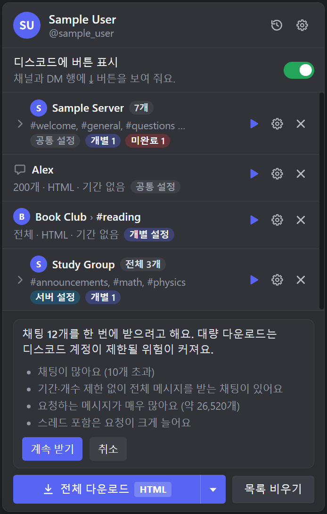
  <br>
  <i>대량 다운로드 확인: 해당하는 이유가 목록으로 나와요. [계속 받기]를 눌러야 시작하고, [취소]나 Esc는 아무 일도 일어나지 않아요.</i>
</p>

- 다운로드는 **한 번에 하나**만 돌아요. 이미 진행 중이면 "이미 다운로드가 진행 중이에요. 끝난 뒤에 다시 시도해 주세요."가 떠요.
- 채팅은 **담은 순서대로 하나씩** 받아요(화면의 트리에서 묶여 보이는 순서와 다를 수 있어요).
- **시작하는 순간의 설정과 목록이 그 작업에 고정돼요.** 받는 도중에 공통 설정이나 서버·카테고리·개별 설정을 바꿔도 지금 작업에는 영향이 없어요. 또 **받는 도중에 목록에 새로 담은 채팅은 이번 작업에 들어가지 않아요.** 목록에 그대로 남아 있으니, 작업이 끝난 뒤 [전체 다운로드]를 다시 누르세요(건너뛴 것처럼 보일 수 있어요).
- 받는 도중에 **디스코드 탭을 닫아도** 작업은 계속돼요(탭은 로그인 확인에만 필요해요).
- **크롬을 완전히 끄면 작업이 멈춰요.** 진행 상태는 크롬이 켜져 있는 동안만 기억돼서, 다시 켜도 "끊겼어요" 같은 표시는 없고 작업이 그냥 사라진 상태가 돼요. 끝낸 채팅은 이미 [기록](#11-기록-화면)에 있고 목록에서 빠져 있어요. 끝내지 못한 채팅은 목록에 그대로 남아 있으니 [전체 다운로드]를 다시 누르면 돼요. ZIP으로 받던 중이었다면 그때까지 모은 내용이 전부 사라져요([10-3](#10-3-zip-파일)).

### 8-4. 진행 상황과 취소

받는 동안 아래쪽이 **전체 진행률**로 바뀌어요: `3/10 · 30%` 같은 숫자와 막대, 그리고 **[취소]** 버튼이에요. 각 채팅 줄에는 채팅별 막대와 상태가 보여요.

<p align="center">
  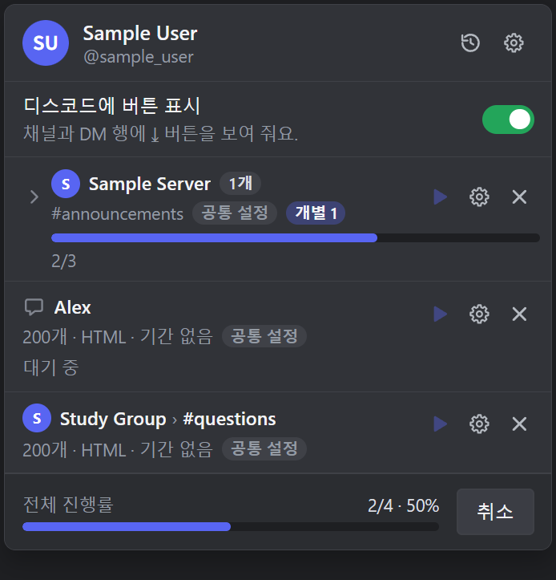
  <br>
  <i>받는 중: 서버 줄의 막대와 2/3, 시작 전 채팅의 "대기 중", 맨 아래의 전체 진행률과 [취소]를 보세요. ▶가 흐린 것은 받는 동안 막혀 있어서예요.</i>
</p>

- **서버·카테고리 줄**에는 그 안 채팅을 합친 `완료/전체`(예: `1/4`)와 막대가 보여요. 줄이 접혀 있어도 보여요. 이미 끝나서 목록에서 빠진 채팅도 합계에 계속 세므로, 하나가 끝났다고 `1/4`가 `0/3`으로 바뀌지는 않아요. 그런 서버·카테고리 줄은 안에 채팅이 하나만 남아도 [한 줄 압축](#8-2-목록트리-읽는-법)되지 않고 그룹 줄로 남아요.
- 상태 문구: **대기 중** → (진행 중에는 단계별로) **채팅 정보 확인 중** / **메시지 가져오는 중** / **스레드 찾는 중** / **첨부파일 받는 중** / **파일 만드는 중** / **저장하는 중** → **완료**. 단계 순서는 설정(ZIP·첨부 등)에 따라 조금 달라요.
- 메시지 수는 `1,234 / 5,000개`(개수 지정) 또는 `1,234개`(전체)처럼 보여요.
- **잠시 멈춤**: 디스코드가 요청 속도를 제한하면 "디스코드 요청 제한 때문에 잠시 쉬고 있어요. 곧 이어서 받아요."가 뜨고 막대가 경고 색(노란색 계열)으로 바뀌어요. 기다리면 알아서 이어져요.
- **[취소]**를 누르면 "취소하는 중…"으로 바뀌고 멈춰요. 이미 끝난 채팅의 파일은 그대로 남아요. 취소된 채팅은 **취소됨**으로 목록에 남아요. ZIP으로 받던 중이면 **끝난 채팅만 담은 "(부분)" ZIP**이 저장돼요.
- 받는 동안에도 ✕·⚙는 쓸 수 있지만 ▶는 막혀 있어요(말풍선: "다운로드가 진행 중이에요"). 서버·카테고리 줄도 같아요.

### 8-5. 끝난 뒤: 완료·실패·재시도

- **성공한 채팅은 목록에서 자동으로 빠지고** [기록](#11-기록-화면)에 남아요.
- **실패·일부 저장·취소된 채팅은 목록에 남아요.** 줄 안에 경고 아이콘과 함께 `상태 · 사유`가 나오고, **[재시도]** 링크로 그 채팅만 다시 받을 수 있어요(▶도 같아요). 실제 모습은 [6-2의 그림](#6-2-계정이-안-보일-때) 맨 아래 줄에서 볼 수 있어요.
  - 상태: **일부만 저장됨**(받은 데이터까지만 `(부분)` 파일로 저장), **실패**(받은 게 없음), **취소됨**
  - 사유 예시: "이 채널을 볼 권한이 없어요" · "채널을 찾을 수 없어요. 삭제됐을 수 있어요" · "디스코드가 요청을 제한했어요. 잠시 뒤에 다시 시도해 주세요" · "디스코드가 요청을 막았어요. 잠시 뒤에 다시 시도해 주세요" · "네트워크에 연결하지 못했어요" · "디스코드 서버에 문제가 있어요. 잠시 뒤에 다시 시도해 주세요" · "디스코드 로그인이 만료됐어요. 디스코드를 새로고침해 주세요" · "파일을 저장하지 못했어요" · "ZIP 파일을 저장하지 못했어요" 등. 드물게 다운로드 엔진 자체에 문제가 생기면 "중간에 끊겼어요. 다시 시도해 주세요" 또는 (영어로) "The download engine stopped before this chat was finished."가 나올 수 있어요. 자세한 대처는 [12장](#12-문제-해결-faq)이에요.
- **서버·카테고리 줄 안**에 그런 채팅이 있으면 그 줄에 붉은 `미완료 N` 칩이 떠요(줄이 접혀 있어도 보여요). 줄을 펼치면 채팅 줄의 [재시도]가 보여요. 서버·카테고리 줄의 ▶를 누르면 그 줄 아래 **목록에 남아 있는 채팅 전부**(실패한 것 포함)를 다시 받아요.
- 한 채팅이 실패해도 **나머지 채팅은 계속** 받아요. 로그인 만료처럼 모든 요청에 똑같이 영향을 주는 문제면 그 채팅에서 작업을 멈춰요.
- 팝업을 열어 둔 채로 작업이 끝나면 목록 아래에 한 줄 요약이 떠요: **다운로드를 마쳤어요** / **N개 완료, M개는 끝내지 못했어요** / **다운로드를 취소했어요** / **다운로드하지 못했어요**. 한 개 이상 성공했으면 **[폴더 열기]**가 있어요. 이 버튼은 **크롬의 기본 다운로드 폴더**를 열어요(그 안에 `Discord Export` 폴더가 있어요). ✕로 닫을 수 있어요.

### 8-6. 툴바 배지

**툴바 배지**는 툴바 아이콘 위에 겹쳐 보이는 작은 숫자·글자예요.

| 배지 | 뜻 |
|---|---|
| 숫자 (예: 5) | 목록에 담긴 채팅 수. 0이면 비어 있고, 999를 넘으면 `999+`로 보여요. **디스코드 계정이 확인되기 전에는 목록이 있어도 비어 있어요.** 예를 들어 크롬을 다시 켠 직후에는 디스코드 탭이 요청을 한 번 보내 계정이 확인될 때까지 숫자가 안 보여요. |
| `3/10` | 다운로드 중: 끝난 채팅 수/전체 채팅 수. 글자가 4자를 넘으면 `45%` 같은 퍼센트로 바뀌어요. |
| 빨간 `!` | 작업이 끝났는데 실패·일부 저장이 있었어요. 팝업을 열면 사라져요. |

### 8-7. 완료 알림

설정에서 알림을 켜 두었다면(기본 켜짐), 작업이 끝났을 때 시스템 알림이 떠요. 제목은 **다운로드 완료** 또는 (실패·일부 저장이 있으면) **일부 실패**, 내용은 `채팅 n개 · 메시지 m개`예요. 알림의 **[폴더 열기]**(또는 알림 자체)를 누르면 마지막으로 저장한 파일을 파일 관리자(Windows는 파일 탐색기)에서 보여 줘요. 사용자가 직접 [취소]한 작업에는 알림이 뜨지 않아요. 운영체제의 알림 설정이나 집중 지원·방해 금지 모드에서 막혀 있으면 안 보일 수 있어요.

---

## 9. 설정

### 9-1. 어디서 무엇을 바꾸나요

"설정"이라는 이름의 화면이 네 군데 있어요. 헷갈리지 않게 먼저 구분해 두세요.

| 여는 곳 | 화면 이름 | 무엇에 적용되나요 | 저장 방식 |
|---|---|---|---|
| 팝업 맨 위 오른쪽 **톱니(⚙)** | **설정**(앱 설정) | 폴더 이름·파일 이름의 날짜·시간대·알림·단축키·안내 ([9-7](#9-7-앱-설정)) | 바로 저장 |
| 팝업 아래쪽 **[전체 다운로드 ▾]의 ▾** | **공통 설정** | 서버·카테고리·개별 설정으로 따로 정하지 않은 모든 채팅 + 언어·ZIP ([9-2](#9-2-공통-설정-서버카테고리-설정-개별-설정) ~ [9-6](#9-6-언어와-zip)) | 바로 저장 |
| 목록의 **서버 줄·카테고리 줄의 ⚙** | **서버 설정** / **카테고리 설정** | 그 서버·카테고리에 담긴 채팅 전부와 앞으로 담는 채팅 ([9-2](#9-2-공통-설정-서버카테고리-설정-개별-설정)) | [저장]을 눌러야 저장 |
| 목록의 **채팅 줄의 ⚙** | **채팅 설정**(개별 설정) | 그 채팅 하나 | [저장]을 눌러야 저장 |

### 9-2. 공통 설정, 서버·카테고리 설정, 개별 설정

**설정이 적용되는 순서**

채팅 하나는 아래 네 가지 중 **정해 둔 것이 있는 가장 위의 설정**으로 받아요. 위에 정해 둔 것이 없으면 한 단계 아래로 내려가요.

| 순서 | 설정 | 어디서 정하나요 | 줄에 붙는 배지 |
|---|---|---|---|
| 1 | **개별 설정**: 채팅 하나만의 설정 | 채팅 줄의 ⚙ | 개별 설정 |
| 2 | **카테고리 설정**: 그 카테고리에 담긴 채팅 전부 | 카테고리 줄의 ⚙ | 카테고리 설정 |
| 3 | **서버 설정**: 그 서버에 담긴 채팅 전부 | 서버 줄의 ⚙ | 서버 설정 |
| 4 | **공통 설정**: 나머지 모든 채팅 | [전체 다운로드 ▾]의 ▾ | 공통 설정 |

- **줄의 배지가 "지금 어느 설정을 따르는지"를 알려 줘요**([8-2](#8-2-목록트리-읽는-법)). 서버·카테고리 줄의 배지는 그 줄 아래 채팅들이 받는 설정이에요(그 줄에 정해 둔 설정이 있으면 `서버 설정`/`카테고리 설정`, 없으면 위쪽 설정).
- 채팅 줄의 요약 줄(`200개 · HTML · 기간 없음`)은 이 순서로 정해진 **실제 적용 값**이에요.
- 서버나 카테고리에 **나중에 담는 채팅도** 담는 순간부터 그 서버·카테고리 설정을 따라가요(디스코드의 ⤓ 버튼으로 담을 때도 같아요).

**공통 설정**은 목록 전체가 따르는 기본 설정이에요.

- 여는 방법: 팝업 아래쪽 **[전체 다운로드 ▾]의 ▾**. 화면 모양은 아래 [9-3](#9-3-형식-6가지) ~ [9-5](#9-5-더보기)의 그림에서 볼 수 있어요.
- 화면 위쪽 안내: "바뀐 내용은 바로 저장돼요. 따로 설정하지 않은 채팅은 모두 이 설정을 따라가요." → **저장 버튼이 없고**, 바꾸는 즉시 적용돼요.
- **올바르지 않은 값은 저장되지 않아요.** 개수가 비어 있거나 1~1,000,000 밖이거나, 시작일이 종료일보다 늦으면 입력 칸 아래에 빨간 안내가 나와요. 값을 고치면 그때 저장돼요.
- **기본값**: 개수 200 · 기간 없음 · 형식 **HTML(다크 테마)** · 첨부/스레드/새 메시지만 꺼짐 · 봇·시스템·반응·임베드 모두 포함 · 언어 자동 · ZIP 꺼짐.

**서버 설정 · 카테고리 설정**은 서버나 카테고리 **하나에 담긴 채팅 전부**에 한 번에 적용하는 설정이에요.

<p align="center">
  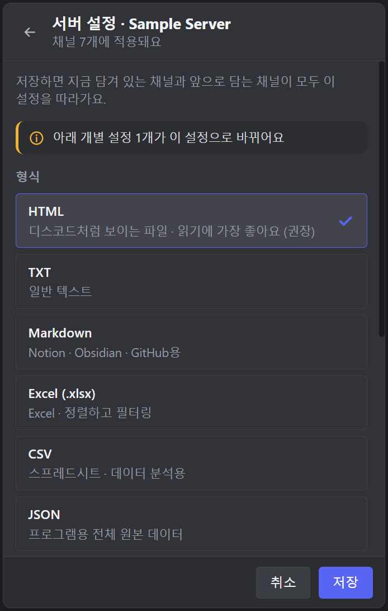
  <br>
  <i>서버 설정 화면: 제목 아래의 "채널 7개에 적용돼요", 노란 알림 "아래 개별 설정 1개가 이 설정으로 바뀌어요", 맨 아래 [취소] · [저장]을 보세요.</i>
</p>

1. 목록에서 **서버 줄 또는 카테고리 줄의 ⚙**를 눌러요([한 줄로 압축](#8-2-목록트리-읽는-법)된 줄의 ⚙는 그 채널 하나의 설정이에요). "서버 설정 · 서버이름" 또는 "카테고리 설정 · 카테고리이름" 화면이 열리고, 제목 아래에 "채널 N개에 적용돼요"가 나와요.
2. 채팅 설정과 같은 항목이 채워져 있어요. 지금 그 줄 아래 채팅들이 따르는 값이에요. **언어**와 **ZIP 하나로 받기**는 없어요.
3. 화면 위에 안내가 나와요. 이 줄에 정해 둔 설정이 아직 없으면 "저장하면 지금 담겨 있는 채널과 앞으로 담는 채널이 모두 이 설정을 따라가요.", 이미 있으면 "따로 정한 설정을 쓰고 있어요. 저장하면 아래 채널 전부에 한 번에 적용돼요."예요.
4. 고친 뒤 **[저장]**을 눌러요. 저장하면 이 줄 아래 채팅 전부가 이 설정을 따라가고, 줄에는 `서버 설정`/`카테고리 설정` 배지가 붙어요. **저장 전에 팝업이 닫히면 고친 내용은 버려져요.**
5. ⚠️ **저장하면 아래의 개별 설정이 지워져요.** 이 줄 아래 채팅 중 개별 설정이 있던 채팅은 개별 설정이 없어지고 이 설정을 따라가요. **서버 설정**을 저장하면 그 서버 안의 **카테고리 설정도 함께 지워져요**(카테고리 아래 채팅은 서버 설정을 따라가요). 카테고리 설정을 저장하면 그 카테고리 채팅의 개별 설정만 지워지고, 서버 설정과 다른 카테고리는 그대로예요. 지워질 것이 있으면 저장하기 전에 **"아래 개별 설정 M개가 이 설정으로 바뀌어요"**가 먼저 나와서 몇 개가 바뀌는지 알려 줘요(M은 지워질 개별 설정과 카테고리 설정을 합친 수예요).
6. 아무것도 바꾸지 않았고 지워질 것도 없으면 [저장]은 아무것도 저장하지 않고 닫아요. 올바르지 않은 값이 있으면 입력 아래에 빨간 안내가 나오고 [저장]이 눌러지지 않아요.
7. 이 줄에 정해 둔 설정이 있으면 **[상위 설정으로 되돌리기]**가 보여요(말풍선: "이 줄에 따로 정한 설정만 지워요. 채널의 개별 설정은 그대로예요."). 누르면 이 줄의 설정만 없어지고, 아래 채팅은 한 단계 위의 설정(카테고리는 서버 설정이 있으면 서버 설정, 없으면 공통 설정. 서버는 공통 설정)을 다시 따라가요. 채팅의 개별 설정은 건드리지 않아요. [취소]는 아무것도 바꾸지 않고 닫아요.
8. **서버·카테고리 설정은 그 줄에 담긴 채팅이 하나도 없게 되면 사라져요.** 채팅을 모두 뺐을 때, 다운로드가 끝나서 마지막 채팅이 목록에서 빠졌을 때, [목록 비우기]를 눌렀을 때가 그래요(디스코드에서 채널이 다른 카테고리로 옮겨져 그 카테고리에 담긴 채널이 없어질 때도 같아요). 나중에 다시 담으면 위쪽 설정부터 시작해요.

**개별 설정**은 채팅 하나만 따로 정하는 설정이에요.

<p align="center">
  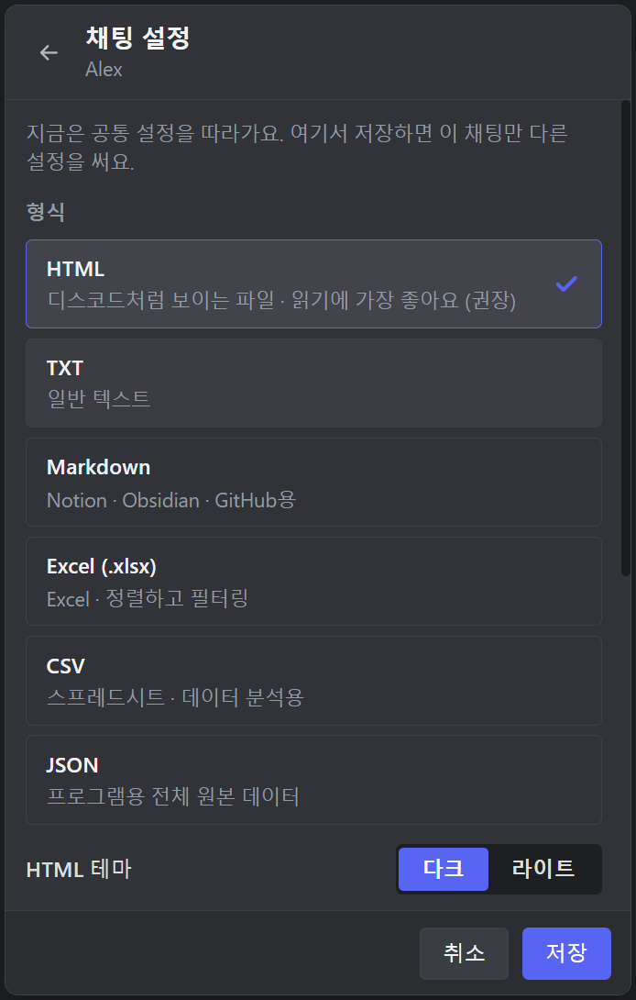
  <br>
  <i>채팅 설정 화면: 맨 위 안내가 지금 따르는 설정을 알려 줘요. 여기서 [저장]하면 이 채팅만 다른 설정을 써요.</i>
</p>

1. 목록에서 그 채팅 줄의 **⚙**를 눌러요. "채팅 설정" 화면이 열려요(제목 아래에 그 채팅 이름이 나와요). 맨 위 안내에는 지금 따르는 설정이 나와요("지금은 서버 설정을 따라가요. 여기서 저장하면 이 채팅만 다른 설정을 써요." 같은 문구예요).
2. 공통 설정과 같은 항목이 채워져 있어요(현재 적용 중인 값). 단, **언어**와 **ZIP 하나로 받기**는 앱 전체 설정이라 여기에는 없어요.
3. 고친 뒤 **[저장]**을 눌러요. 그 줄에 **개별 설정** 라벨이 붙고, 이후 공통·서버·카테고리 설정을 바꿔도 이 채팅은 그대로예요(서버·카테고리 설정을 [저장]하면 이 채팅의 개별 설정이 지워지는 점만 조심하세요). **저장 전에 팝업이 닫히면 고친 내용은 버려져요.**
4. 아무것도 바꾸지 않고 [저장]하면 개별 설정이 생기지 않고 계속 위쪽 설정을 따라가요.
5. 개별 설정이 있는 채팅을 열면 되돌리기 버튼이 보여요. 누르면 개별 설정이 사라지고 다시 위쪽 설정을 따라가요. 버튼 이름은 **다시 따르게 될 설정**에 따라 **[카테고리 설정으로 되돌리기]** / **[서버 설정으로 되돌리기]** / **[공통 설정으로 되돌리기]** 중 하나예요(그 채팅의 카테고리에 설정이 있으면 카테고리 설정, 없고 서버에 있으면 서버 설정, 둘 다 없으면 공통 설정). [취소]는 아무것도 바꾸지 않고 닫아요.
6. 올바르지 않은 값(개수가 범위 밖, 시작일이 종료일보다 늦음 등)이 있으면 입력 아래에 빨간 안내가 나오고 [저장]이 눌러지지 않아요(말풍선: "올바르지 않은 값이 있어요").

설정 화면 항목은 아래 9-3 ~ 9-6과 같아요.

### 9-3. 형식 (6가지)

카드 6개 중 하나를 골라요(선택한 카드가 강조되고 체크가 보여요).

<p align="center">
  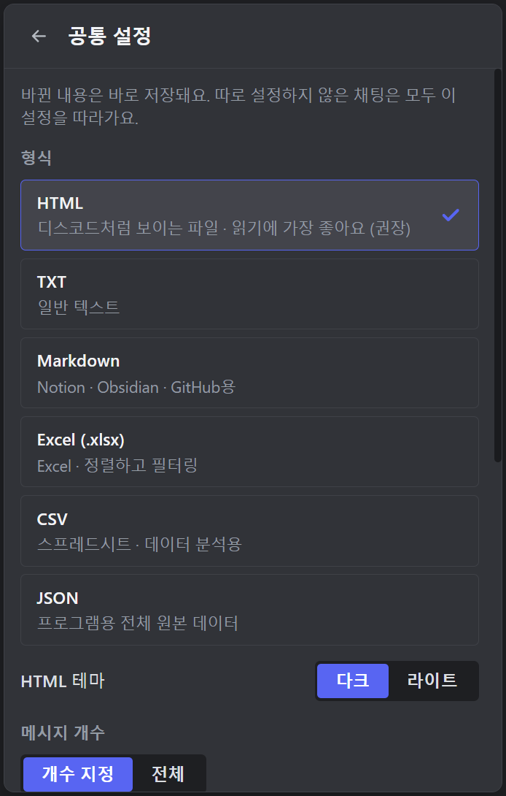
  <br>
  <i>공통 설정 화면의 위쪽: 형식 카드 6개(선택한 HTML에 체크)와 HTML 테마(다크/라이트)가 보여요. 맨 위 안내처럼 바꾸는 즉시 저장돼요.</i>
</p>

| 형식 | 카드 설명 | 이럴 때 쓰세요 |
|---|---|---|
| **HTML** | 디스코드처럼 보이는 파일 · 읽기에 가장 좋아요 (권장) | 그냥 **읽고 보관**할 때. 브라우저로 열면 디스코드와 비슷한 모양(날짜 구분선, 같은 사람 연속 메시지 묶음, 답장 미리보기, 임베드, 반응, 스티커, 투표, 스포일러)으로 보여요. 파일 하나로 되어 있고 스크립트가 없어요. |
| **TXT** | 일반 텍스트 | 메모장 등으로 열어 보거나 **검색**할 때. 맨 위 머리말과 맨 아래 요약이 있는 단순한 로그예요. |
| **Markdown** | Notion · Obsidian · GitHub용 | 노트 앱에 **붙여 넣거나** 문서로 관리할 때. 날짜별 `## 2026-10-06` 제목이 붙어요. |
| **Excel (.xlsx)** | Excel · 정렬하고 필터링 | **표로 정렬·필터**하고 싶을 때. 메시지 하나가 한 행이에요. |
| **CSV** | 스프레드시트 · 데이터 분석용 | 다른 스프레드시트·분석 도구로 **가져갈** 때. 한글이 깨지지 않도록 UTF-8 BOM이 붙어요([부록 A](#부록-a-용어-설명)). |
| **JSON** | 프로그램용 전체 원본 데이터 | 프로그램으로 **가공**할 때. 디스코드가 준 메시지 데이터를 거의 그대로 담아요. |

- **HTML 테마**: 형식이 HTML일 때만 나와요. **[다크]**(기본) / **[라이트]**.
- 각 형식 파일 안에 무엇이 들어 있는지는 [10-4](#10-4-형식별-파일-내용)에 있어요.

### 9-4. 메시지 개수와 기간

아래 그림은 공통 설정 화면을 아래로 스크롤한 모습이에요.

<p align="center">
  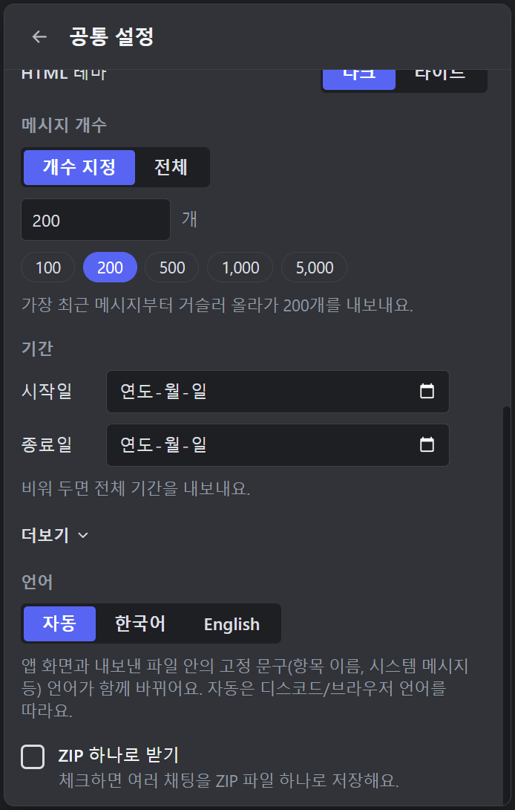
  <br>
  <i>메시지 개수(숫자 칸과 빠른 선택 버튼)와 기간(시작일·종료일)이 보여요. 그 아래의 더보기는 9-5, 언어와 ZIP은 9-6에서 설명해요.</i>
</p>

**메시지 개수**

- **[개수 지정]**: 숫자 입력 칸(기본 `200`, 단위 "개")이 나와요. **1에서 1,000,000** 사이의 **정수**여야 해요. 입력 칸 아래 **빠른 선택** 버튼(100 · 200 · 500 · 1,000 · 5,000)으로 한 번에 넣을 수도 있어요. 가장 **최근 메시지부터 거슬러 올라가며** N개를 가져와요.
- **[전체]**: 개수 제한 없이 채널의 모든 메시지를 받아요. 기간을 정하지 않으면 "채널의 모든 메시지를 내보내요. 메시지가 많으면 시간이 오래 걸리고 요청도 많아져요."라는 경고가 떠요.
- 이 개수는 **파일 하나마다** 적용돼요. "스레드 포함"이나 포럼은 스레드·게시글마다 따로 N개씩이에요.
- 이 개수는 **봇·시스템 메시지를 걸러 내기 전**의 메시지 수 기준이에요([9-5](#9-5-더보기)).

**기간**

- **시작일**과 **종료일**을 날짜 선택기로 정해요(각각 오른쪽 ✕로 지우기: "시작일 지우기" / "종료일 지우기"). 비워 두면 "비워 두면 전체 기간을 내보내요."라는 뜻이에요.
- 날짜는 **이 컴퓨터의 시간대 기준 하루**예요. 시작일은 그날 00:00:00부터, 종료일은 그날 23:59:59까지 포함해요(종료일 당일 메시지도 들어가요). 이 기준은 앱 설정의 **시간대**와는 별개예요. 앱 설정에서 다른 시간대를 골랐다면 파일 머리말에 적힌 범위의 시각은 그 시간대로 표시되므로, 내가 고른 날짜의 경계와 숫자가 다르게 보일 수 있어요([9-7](#9-7-앱-설정)).
- 시작일이 종료일보다 늦으면 "시작일이 종료일보다 늦어요."라고 나와요.

**개수 + 기간을 함께 쓰면**: **기간 안에서 가장 최신 N개**예요. 예를 들어 시작일 1월 1일, 종료일 1월 31일, 개수 500이면 "1월 한 달 중 가장 마지막 500개"를 받아요(그 기간에 메시지가 500개보다 적으면 있는 만큼). 이때 안내가 "기간 안에서 최신 500개를 내보내요."로 바뀌어요. 개수 [전체] + 기간이면 "기간 안의 모든 메시지를 내보내요."예요.

### 9-5. 더보기

"더보기"를 누르면 펼쳐져요(기본값이 아닌 옵션이 켜져 있으면 처음부터 펼쳐져 있어요).

<p align="center">
  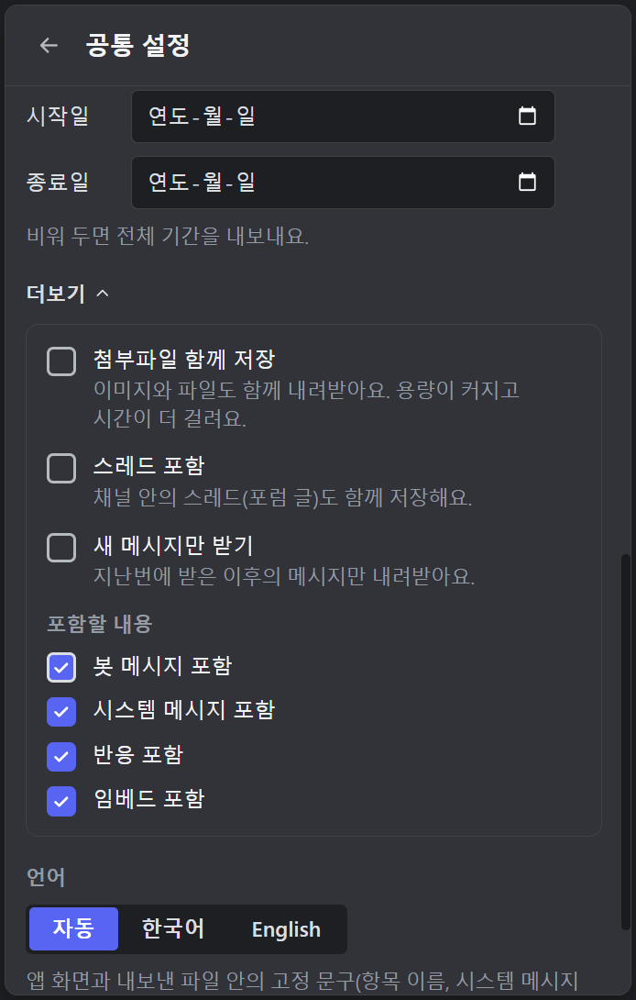
  <br>
  <i>더보기를 펼친 모습: 위쪽 세 옵션은 기본 꺼짐, "포함할 내용" 네 가지는 기본 켜짐이에요.</i>
</p>

| 옵션 | 설명 |
|---|---|
| **첨부파일 함께 저장** | 이미지와 파일도 함께 내려받아요. 용량이 커지고 시간이 더 걸려요. 저장 위치와 이유는 [10-5](#10-5-첨부파일과-링크-만료)를 보세요. 기본 꺼짐. |
| **스레드 포함** | 채널 안의 스레드(포럼 글)도 함께 저장해요(텍스트·공지 채널의 활성·보관된 스레드). 켜면 "스레드를 찾는 데 요청이 많이 들어서 시간이 오래 걸리고, 디스코드가 요청을 제한할 수 있어요."라는 경고가 떠요. 포럼·미디어 채널은 이 옵션과 상관없이 게시글(스레드)마다 파일이 하나씩 만들어져요. 기본 꺼짐. |
| **새 메시지만 받기** | 지난번에 받은 이후의 메시지만 내려받아요(증분 백업). 아래 주의사항을 꼭 읽어 보세요. 기본 꺼짐. |
| **포함할 내용**: 봇 메시지 · 시스템 메시지 · 반응 · 임베드 포함 | 끄면 그 종류를 파일에서 빼요. **봇 메시지**(봇·웹훅이 보낸 메시지), **시스템 메시지**(입장·고정·스레드 생성 같은 안내), **반응**(이모지 반응), **임베드**(링크 미리보기 등). 기본은 모두 켜짐. |

**"포함할 내용"과 메시지 개수**: 메시지 개수 N은 **걸러 내기 전**의 메시지 수 기준이에요. 먼저 최근 N개를 가져온 다음에 봇·시스템 메시지를 빼요. 그래서 **봇 메시지나 시스템 메시지를 끄면 파일 속 메시지가 N개보다 적을 수 있어요.** 빠진 것은 데이터가 사라진 게 아니라 제외된 거예요. 기록 화면의 "메시지 N개"도 파일에 실제로 쓴 개수예요. (반응과 임베드를 끄면 메시지 자체는 그대로고 그 부분만 빠져요.)

**"새 메시지만 받기"의 동작과 주의사항**

- "지난번"이란 **그 채팅을 마지막으로 성공적으로 받은 지점**(그때 받은 가장 최신 메시지)이에요. 채팅·계정마다 따로 기억해요. 기간을 정해서 받았다면 그 기간의 마지막 메시지가 기준이 돼요(기준은 뒤로 물러나지 않아요). 이 기준은 **완료**된 다운로드에서만 앞으로 움직여요(일부 저장·실패·취소는 움직이지 않아요).
- 한 번도 받은 적 없는 채팅이면 평소처럼 받아요.
- **새 메시지가 하나도 없으면 파일이 만들어지지 않아요.** 목록에서는 빠지고 기록에는 "메시지 0개"로 남아요.
- ⚠️ **개수 제한과 같이 쓰면 사이가 비어요.** 공통 설정 화면에 이런 경고가 떠요: "개수 제한(200개)과 함께 쓰면 지난번 이후 메시지가 200개보다 많을 때 그 사이가 비어요. 빠짐없이 받으려면 개수를 "전체"로 하세요." 지난번 이후 새 메시지가 많을 수 있다면 개수를 **[전체]**로 하세요.
- ⚠️ **"스레드 포함"과 같이 쓰면 메시지가 건너뛰어질 수 있어요.** 이 기준점은 채널 본문만이 아니라 **함께 받은 스레드·포럼 글의 메시지까지 통틀어 가장 최신인 메시지**로 정해져요. 채널 본문을 먼저 받고 스레드를 나중에 받는데(스레드가 많으면 몇 분 넘게 걸려요), 그 사이에 채널 본문에 올라온 메시지가 나중에 받은 스레드 메시지보다 오래된 시각이면 기준점보다 오래된 것이 되어 **다음번 "새 메시지만 받기"에서 조용히 빠져요.** 포럼·미디어 채널은 "스레드 포함"과 상관없이 늘 게시글 단위로 받으므로 같은 주의가 필요해요(게시글을 받는 사이에 이미 받은 게시글에 달린 글이 같은 식으로 빠질 수 있어요). 하나도 놓치면 안 되는 백업이라면 이 두 옵션을 **같이 쓰지 않는 것을 권해요.** 스레드까지 받아야 한다면 "새 메시지만 받기"를 끄고 기간으로 범위를 정하세요.
- 기록의 [다시 받기]는 새 메시지만 받는 것이 아니라 **같은 범위를 다시** 받아요([11장](#11-기록-화면)).

### 9-6. 언어와 ZIP

공통 설정 화면 맨 아래에 있어요(개별 설정에는 없어요). 모습은 위 [9-4](#9-4-메시지-개수와-기간)의 그림 아래쪽에서 볼 수 있어요.

- **언어**: **[자동]** / **[한국어]** / **[English]**. "앱 화면과 내보낸 파일 안의 고정 문구(항목 이름, 시스템 메시지 등) 언어가 함께 바뀌어요. 자동은 디스코드/브라우저 언어를 따라요." → 팝업·알림·디스코드 위 알림 문구와, 파일 속 `서버`·`채널`·`내보낸 시각` 같은 머리말, 시스템 메시지 문구, 부분 저장 표시 `(부분)`/`(partial)`이 같이 바뀌어요. 메시지 본문은 바뀌지 않아요.
- **ZIP 하나로 받기**: 체크하면 "여러 채팅을 ZIP 파일 하나로 저장해요." 한 번에 받는 모든 채팅(▶로 하나만 받을 때도)이 ZIP 파일 하나로 묶여 저장돼요. **ZIP은 작업이 모두 끝나야 폴더에 나타나요.** 긴 작업이라면 ZIP을 쓰지 않는 편이 안전해요. 자세한 내용과 구조는 [10-3](#10-3-zip-파일)에 있어요.

### 9-7. 앱 설정

팝업 헤더의 **설정(톱니)** 아이콘으로 열어요. 바꾸면 바로 저장돼요.

<p align="center">
  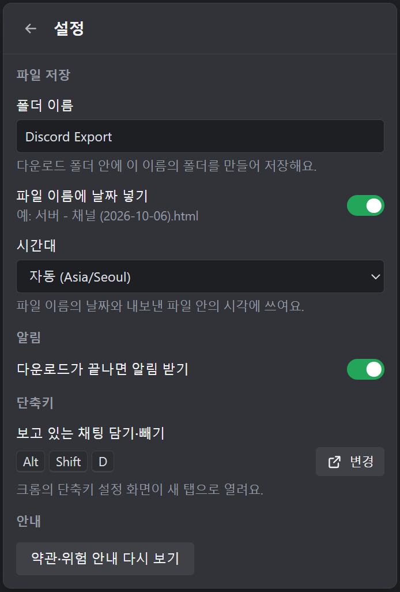
  <br>
  <i>앱 설정 화면: 파일 저장(폴더 이름·날짜·시간대), 알림, 단축키, 안내 순서예요. 단축키는 [변경]으로 크롬의 단축키 설정을 열어 바꿔요.</i>
</p>

| 구역 | 항목 | 설명 |
|---|---|---|
| **파일 저장** | **폴더 이름** | 기본 `Discord Export`. 크롬 다운로드 폴더 **안에** 이 이름의 폴더를 만들어 거기에 저장해요. 입력 칸을 벗어나거나 Enter를 누르면 저장돼요. 비우면 안 되고, `\ / : * ? " < > \|` 문자는 쓸 수 없어요(그래서 다른 드라이브나 하위 폴더 경로는 여기서 지정할 수 없어요). 최대 80자예요. 다른 드라이브에 저장하고 싶으면 크롬 설정의 다운로드 위치를 바꾸세요([10-1](#10-1-저장-위치와-이름-규칙)). |
| | **파일 이름에 날짜 넣기** | 기본 켜짐. 예: `서버 - 채널 (2026-10-06).html`. 이 날짜는 **내보낸 날**이에요. |
| | **시간대** | 기본값은 `자동 (<브라우저 시간대 이름>)` 형태예요(예: `자동 (Asia/Seoul)`). 브라우저 시간대를 알 수 없을 때만 `자동 (브라우저 시간대)`로 보여요. 파일 이름의 날짜와 내보낸 파일 안의 시각 표기(머리말·꼬리말의 시각, 범위 표시 포함)에 쓰여요. 목록에서 다른 지역을 이름(`Asia/Seoul`, `America/New_York`, `UTC` 같은 표준 시간대 이름)으로 고를 수 있어요. 날짜 **기간**의 하루 경계는 이 설정이 아니라 이 컴퓨터의 시간대를 따라요([9-4](#9-4-메시지-개수와-기간)). |
| **알림** | **다운로드가 끝나면 알림 받기** | 기본 켜짐. |
| **단축키** | **보고 있는 채팅 담기·빼기** | 지금 지정된 키를 보여 주고(없으면 "설정 안 됨"), **[변경]**을 누르면 크롬의 단축키 설정 화면이 새 탭으로 열려요([7-5](#7-5-단축키)). |
| **안내** | **약관·위험 안내 다시 보기** | 첫 실행 때의 안내를 다시 읽어요(동의한 시각도 보여 줘요). 돌아가려면 **← 뒤로** 또는 [닫기]. |

---

## 10. 결과 파일

### 10-1. 저장 위치와 이름 규칙

파일은 **크롬의 다운로드 폴더** 안, 앱 설정의 **폴더 이름**(기본 `Discord Export`) 폴더에 저장돼요. 별도로 저장 위치를 묻지 않고 바로 저장돼요(묻는 경우는 [12-13](#12-13-다운로드할-때마다-다른-이름으로-저장-창이-떠요)을 보세요).

- **다운로드 폴더의 기본 위치**: Windows는 `C:\Users\<사용자 이름>\Downloads`, macOS는 `~/Downloads`(홈 폴더 안의 `Downloads`)예요. 크롬 설정에서 바꿨을 수 있으니 `chrome://settings/downloads`의 "위치"에서 확인하세요.
- **다른 드라이브나 다른 폴더에 저장하고 싶다면** 이 확장 프로그램의 폴더 이름이 아니라 **크롬 설정**(`chrome://settings/downloads`)에서 다운로드 위치를 바꾸세요.

| 종류 | 경로 / 파일 이름 (예시, 날짜 넣기 켜짐) |
|---|---|
| 서버 채널 | `Discord Export/내 서버 - 일반 (2026-10-06).html` |
| DM · 그룹 DM | `Discord Export/DM - 친구이름 (2026-10-06).html` |
| 스레드 · 포럼 게시글 | `Discord Export/내 서버 - 부모 채널 - 스레드 제목 (2026-10-06).html` |
| 부분 저장 | `Discord Export/내 서버 - 일반 (2026-10-06) (부분).html` |
| 첨부파일 | `Discord Export/내 서버 - 일반 (2026-10-06)_files/<첨부ID>_<원래 이름>` |
| ZIP | `Discord Export/Discord Export 2026-10-06 1437.zip` |

- 이름은 `서버 - 채널` 형태이고, "파일 이름에 날짜 넣기"를 끄면 ` (2026-10-06)` 부분이 빠져요. 확장자는 형식에 따라 `.html` `.txt` `.md` `.xlsx` `.csv` `.json`이에요.
- 날짜는 **받은 날**(앱 설정의 시간대 기준)이에요. 메시지 날짜가 아니에요.
- 같은 이름의 파일이 이미 있으면 크롬이 ` (1)`을 붙여 덮어쓰지 않고 새로 저장해요.
- 한 번의 내보내기에서 이름이 같은 스레드가 둘 이상이면 이름 뒤에 ` [채널ID]`가 붙어요.
- 포럼·미디어 채널은 게시글마다, "스레드 포함"을 켠 텍스트 채널은 채널 파일 하나 + 스레드마다 파일이 하나씩 만들어져요.
- DM 이름은 디스코드가 알려 주는 표시 이름이에요.

<details>
<summary>파일 이름이 바뀌는 세부 규칙 (펼쳐서 보기)</summary>

- `\ / : * ? " < > |`와 `%`, 제어문자는 `_`로 바뀌고, 앞뒤의 공백·점은 지워요.
- 윈도우 예약 이름(`CON`, `NUL` 등)은 앞에 `_`가 붙어요.
- 한 이름은 80자(경로 전체 180자 안팎)까지만 쓰이고 더 길면 잘려요. 날짜와 `(부분)` 표시, 확장자는 잘리지 않아요.
- 폴더 이름도 같은 규칙으로 정리돼요.

</details>

### 10-2. 부분 저장: (부분)

받는 도중에 문제가 생겨서(요청 제한, 네트워크 끊김 등) **일부만 받았을 때**, 받은 데이터까지를 저장하고 파일 이름 뒤에 ` (부분)`을 붙여요(언어가 English면 ` (partial)`). 머리말이 있는 형식에는 부분 저장이라는 표시도 들어가요(HTML·TXT·Markdown은 "부분 저장 - 중간에 중단되어 일부 메시지가 빠졌을 수 있습니다", JSON은 `"partial": true`, Excel은 "정보" 시트). 이때 목록에는 **일부만 저장됨**으로 남고, [재시도]하면 전체를 다시 받아요. 받은 게 하나도 없으면 파일 없이 **실패**예요.

- **어느 부분이 남나요**: 메시지는 **가장 최신 것부터 거슬러 올라가며** 가져오기 때문에, `(부분)` 파일에는 **문제가 생기기 전까지 도달한 가장 최근 메시지들**이 들어 있고 **오래된 메시지가 빠져 있어요.**
- **스레드·포럼 글에서만 문제가 생긴 경우**에는 채널 본문 파일은 **완전하고 `(부분)` 표시도 없어요.** 도중에 끊긴 스레드 파일이 있으면 그 파일만 `(부분)`이에요(스레드 목록 자체를 못 가져왔다면 스레드 파일은 아예 없어요). 어느 경우든 목록에는 **일부만 저장됨**과 `스레드: …`/`게시글: …`로 시작하는 사유가 남아요.

### 10-3. ZIP 파일

공통 설정에서 **ZIP 하나로 받기**를 켜면 한 번에 받는 모든 채팅이 ZIP 하나로 저장돼요.

- ZIP 이름: `<폴더 이름>/Discord Export 2026-10-06 1437.zip` (날짜와 시·분, 앱 설정의 시간대 기준). 작업이 **취소되거나 중단**돼 끝난 채팅만 담은 경우에만 ZIP 이름에 `Discord Export 2026-10-06 1437 (부분).zip`처럼 `(부분)`이 붙어요.
- ZIP 안의 구조(안쪽 파일 이름에는 날짜가 붙지 않아요):

```text
Discord Export 2026-10-06 1437.zip
├─ 내 서버/
│  ├─ 카테고리 이름/
│  │  ├─ 일반.html
│  │  ├─ 일반_files/            <- 첨부파일 저장을 켰을 때
│  │  │  └─ <첨부ID>_<원래 이름>
│  │  ├─ 부모 채널 - 스레드 제목.html
│  │  └─ 포럼 이름/
│  │     └─ 게시글 제목.html
│  └─ 카테고리 없는 채널.html   <- 카테고리가 없으면 서버 폴더 바로 아래
└─ Direct Messages/
   └─ 친구이름.html
```

- **끝까지 가지 못한 채팅의 안쪽 이름**: 문제로 중간에 끊긴 채팅은 ZIP 안에서도 `일반 (부분).html`처럼 ` (부분)`(English는 ` (partial)`)이 붙어요. 그래도 **ZIP 파일 자체**의 이름에는 작업이 취소·중단되지 않은 한 `(부분)`이 붙지 않아요.
- 이름이 겹치면 ` [채널ID]`나 ` (2)`가 붙어요.
- ZIP 하나에는 **약 3.75GB** 또는 **파일 65,535개**까지만 담을 수 있어요. 넘으면 "ZIP 파일 하나에 담을 수 있는 크기(약 3.75GB)를 넘었어요. 한 번에 받는 채팅 수를 줄여 주세요" 같은 안내가 떠요.
- 채팅이 ZIP에 들어가야 "저장됨"으로 쳐요. ZIP 저장이 실패하면 그 채팅들은 실패로 남아요.
- ⚠️ **ZIP은 맨 마지막에 한 번만 저장돼요.** 받는 동안에는 폴더에 아무 파일도 생기지 않아요. 채팅이 목록에서 빠지는 것도 ZIP이 저장된 뒤예요(진행 막대에는 먼저 "완료"로 보일 수 있어요). 작업이 모두 끝났을 때, 또는 [취소]나 로그인 만료로 작업이 중간에 멈췄을 때(이때는 끝난 채팅만 담은 "(부분)" ZIP이 저장돼요)만 파일이 생겨요. **그 전에 크롬을 끄거나 확장 프로그램을 새로고침하면 그때까지 받은 내용이 전부 사라져요.** 오래 걸리는 작업이라면 ZIP을 쓰지 않고 개별 파일로 받는 편이 안전해요(ZIP을 쓰지 않을 때는 채팅이 끝날 때마다 파일이 저장돼요).

### 10-4. 형식별 파일 내용

**공통**: 모든 형식에서 메시지는 **오래된 것 → 최신** 순서예요. 시각은 앱 설정의 시간대로 적혀요. 머리말·꼬리말의 시각과 TXT·CSV·Excel의 시각은 `YYYY-MM-DD HH:mm:ss`(24시간제)예요. HTML과 Markdown은 메시지마다 보이는 시각의 모양이 달라요(아래 참고). 열 이름과 머리말의 고정 문구는 **언어** 설정(한국어/English)을 따라가요.

**HTML**

<p align="center">
  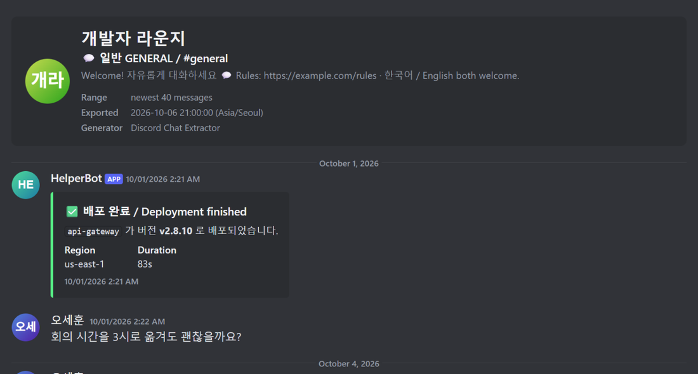
  <br>
  <i>HTML 파일을 브라우저로 연 모습(예시 데이터): 맨 위 머리말 카드, 날짜 구분선, 봇 메시지의 임베드가 디스코드처럼 보여요.</i>
</p>

이 예시는 언어를 English로 해서 만든 파일이라 머리말 항목 이름(Range · Exported · Generator)과 시각 모양이 영어식이에요. 한국어로 받으면 `범위` · `내보낸 시각` · `생성 도구`, `2026. 10. 06. 오후 3:04` 같은 모양으로 나와요.

- 안에 든 것: 맨 위 머리말 카드(서버 또는 채널 이름·아이콘, 채널 경로, 주제, **범위**(예: "최근 200개 메시지"), 내보낸 시각(시간대), 생성 도구). 맨 아래에 메시지 수·첫/마지막 메시지 시각과 링크 만료 안내. 메시지가 없으면 "내보낼 메시지가 없습니다."
- 메시지 표현: 디스코드 모양. 같은 사람의 연속 메시지를 묶고 날짜 구분선, 답장 미리보기, 수정됨, 전달된 메시지, 첨부(이미지·동영상 표시), 임베드, 스티커, 투표, 반응, 스포일러(마우스를 올리면 보임)를 표시해요. 메시지 시각은 디스코드처럼 `2026. 10. 06. 오후 3:04` 모양으로 보이고(같은 사람의 연속 메시지는 `오후 3:04`만), 마우스를 올리면 요일까지 나와요.
- 잘 맞는 경우: 읽고 보관할 때.

**TXT**
- 안에 든 것: 위에 서버, 채널, 주제, 범위, 내보낸 시각, 생성 도구. 아래에 **메시지 수**, 첫 메시지, 마지막 메시지 시각.
- 메시지 표현: 메시지마다 `[2026-10-06 12:00:00] 작성자` 줄과 본문. 시스템 메시지는 `* 문구`, 답장은 `> ↪ …`, 첨부·임베드·스티커·투표·반응은 `{첨부 파일}` 같은 구역으로 표시해요.
- 잘 맞는 경우: 검색하거나 메모장으로 볼 때.

TXT 파일의 앞부분은 이런 모양이에요(예시 데이터, 앞부분만 발췌했어요).

```text
================================================================
Server: 개발자 라운지
Channel: 💬 일반 GENERAL / #general
Range: newest 6 messages
Exported: 2026-10-06 21:00:00 (Asia/Seoul)
Generator: Discord Chat Extractor
================================================================

[2026-10-05 20:57:30] 강하은
혹시 TypeScript strict 모드에서 이 타입 에러 나는 분 계신가요?

[2026-10-05 20:58:02] ミナ (Mina)
Could you share the repro steps? I cannot trigger it locally.

[2026-10-05 21:00:00] 정우진
> ↪ Replying to Alex Rivera: Lunch at 12:30? There is a new ramen place around the corner.
이슈 번호 #482 확인 부탁드립니다.
```

이 예시도 언어를 English로 만든 파일이에요. 한국어로 받으면 머리말이 `서버:` · `채널:` · `범위: 최근 6개 메시지` · `내보낸 시각:` · `생성 도구:`로, 답장 줄이 `> ↪ Alex Rivera님에게 답장: …`으로 나와요. 채널에 주제가 있으면 `주제:` 줄이 머리말에 더 들어가요.

**Markdown**
- 안에 든 것: 위에 `# 서버 - 채널` 제목과 서버·채널·주제·범위·내보낸 시각·생성 도구 목록. 아래에 메시지 수·첫/마지막 메시지.
- 메시지 표현: 날짜별 `## 2026-10-06` 제목 아래에 메시지를 두고, 작성자는 굵게, 시각은 작은 글씨로 적어요. **메시지마다 보이는 시각은 `HH:mm:ss`뿐이고 날짜는 위의 날짜 제목에만 있어요.** (머리말·꼬리말에는 날짜까지 적혀요.) 이미지는 ``로 표시해요.
- 잘 맞는 경우: 노트 앱(Notion·Obsidian)이나 GitHub에 붙일 때.

**Excel (.xlsx)**
- 안에 든 것: 머리말 없음. 범위를 제한했거나(개수·기간·새 메시지만) 부분 저장이면 두 번째 시트 **"정보"**에 서버·채널·범위·내보낸 시각·메시지 수 등을 적어요.
- 메시지 표현: 메시지 하나가 한 행. 열: 메시지 ID, 시각, 수정 시각, 작성자 ID, 작성자, 봇, 내용, 첨부 파일, (저장된 파일), 임베드, 스티커, 리액션, 답장 대상, 유형. 시각은 `YYYY-MM-DD HH:mm:ss`예요.
- 잘 맞는 경우: 정렬·필터를 쓸 때.

**CSV**
- 안에 든 것: 머리말 없음(표만 들어요). 첫 줄이 열 이름. UTF-8 BOM 포함.
- 메시지 표현: Excel과 같은 열. ID는 `="123..."` 꼴로 적혀요(스프레드시트가 숫자로 바꿔 뒷자리를 잃지 않게 하려는 것). 프로그램으로 읽을 때는 `="`와 `"`를 벗겨 쓰세요. 시각은 `YYYY-MM-DD HH:mm:ss`예요.
- 잘 맞는 경우: 다른 스프레드시트·분석 도구로 가져갈 때.

**JSON**
- 안에 든 것: 위에 `exportedAt`, `generator`, `channel`(id·이름·종류·서버·카테고리·주제), `range`(after·before·limit)와, 해당하면 `incremental`/`partial`. 아래에 `messageCount`, `firstMessageAt`, `lastMessageAt`.
- 메시지 표현: `messages` 배열에 디스코드가 준 메시지 객체를 한 줄에 하나씩 담아요. 첨부를 저장했으면 첨부 `url` 바로 뒤에 `local_path`가 붙어요.
- 잘 맞는 경우: 프로그램으로 가공할 때.

### 10-5. 첨부파일과 링크 만료

디스코드 서버에 올라간 첨부파일·이미지의 링크는 **서명된 임시 주소**라서 **약 24시간 뒤 만료**돼요. 그래서 "첨부파일 함께 저장"을 끄고 받은 파일은 하루쯤 지나면 이미지와 첨부파일이 열리지 않을 수 있어요(HTML 파일 맨 아래에도 이 안내가 적혀 있어요). 메시지 글자는 그대로 남아요.

**"첨부파일 함께 저장"을 켜면**:

- 메시지를 받은 직후 첨부파일을 함께 내려받아요(6시간이 지난 링크는 먼저 새로 받아요). 그래서 만료되기 전에 확보돼요.
- 저장 위치: 채팅 파일 옆의 **`<파일 이름>_files` 폴더** 안에 `<첨부ID>_<원래 이름>`으로 저장해요. 예: `내 서버 - 일반 (2026-10-06)_files/123456789_사진.png`. (ZIP에서는 ZIP 안 같은 위치에 들어가요.)
- 형식별 연결: **HTML·Markdown**은 저장된 파일로 바로 링크/표시하고, **TXT**는 링크 뒤에 `-> 경로`를, **CSV·Excel**은 "저장된 파일" 열에, **JSON**은 `local_path` 값에 저장 경로를 적어요.
- `_files` 폴더는 채팅 파일과 **같은 폴더에 함께** 두어야 링크가 열려요. 파일을 옮길 때 같이 옮기세요.
- 저장하는 것은 **업로드된 첨부파일**(이미지·동영상·문서 등)이에요. 프로필 사진, 임베드 미리보기, 이모지, 스티커 같은 것은 저장되지 않고 링크로 남아요.
- **ZIP을 쓰지 않을 때**는 첨부파일 하나하나가 별도 다운로드로 저장돼요(첨부가 많으면 파일 수도 많아져요). 이럴 때는 ZIP이 편해요.
- 일부 첨부파일을 못 받았어도 채팅 파일은 정상 저장돼요. 기록 화면에 "첨부파일 N개를 저장하지 못했어요"가 적혀요.

---

## 11. 기록 화면

팝업 헤더의 **기록**(시계 모양에 화살표) 아이콘으로 열어요. 제목은 **다운로드 기록**이에요. 돌아가려면 **← 뒤로**를 누르세요.

<p align="center">
  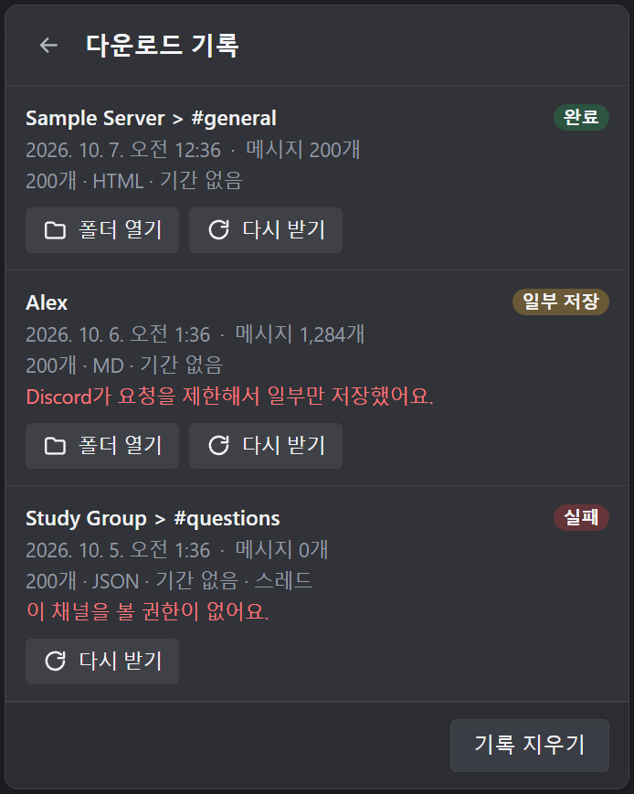
  <br>
  <i>기록 화면: 상태 배지(완료 · 일부 저장 · 실패), 받은 시각과 메시지 수, 사유, 줄마다 [폴더 열기] · [다시 받기], 맨 아래 [기록 지우기]를 보세요. 받은 파일이 없는 줄에는 [폴더 열기]가 없어요.</i>
</p>

- **무엇이 보이나요**: 받은 채팅이 **최신순**으로 나와요(계정마다 최대 200개까지 보관). 각 줄에는 채팅 이름, 상태 배지(**완료** / **일부 저장** / **실패**), 받은 시각, **메시지 N개**, 그때 적용된 설정 요약(`200개 · HTML · 기간 없음 …`), 문제가 있었으면 사유가 보여요. 비어 있으면 "아직 받은 기록이 없어요."가 나와요.
- **[폴더 열기]**: 그 기록의 **첫 번째로 저장된 파일**을 파일 관리자에서 **선택해서 보여 줘요**(ZIP이면 그 ZIP 파일이에요). 파일을 옮기거나 지웠으면 열리지 않을 수 있어요. 저장된 파일이 없는 기록(예: 새 메시지가 없던 "새 메시지만 받기")에는 이 버튼이 없어요.
- **[다시 받기]**: 그 채팅을 **그때 쓴 설정(같은 개수·기간·형식)으로 다시** 받아요. 목록과는 상관없이 그 채팅 하나만 새 작업으로 시작하고 메인 화면으로 돌아가요. "새 메시지만 받기"로 받았던 기록이어도 **다시 받기는 새 메시지만이 아니라 같은 범위 전체**를 받아요. 목록은 건드리지 않고, 기록 줄도 그대로 남아요.
- **[기록 지우기]**: "기록을 모두 지울까요?"에서 [지우기] / [취소]를 골라요. 기록 목록만 지워지고 **저장된 파일은 지워지지 않아요.**

---

## 12. 문제 해결 (FAQ)

### 12-1. 증상으로 찾기

| 이런 증상이 있어요 | 보세요 |
|---|---|
| 설치가 안 돼요 / 크롬이 오류를 내요 / `npm`이 안 돼요 | [5-6. 설치가 안 될 때](#5-6-설치가-안-될-때) |
| 디스코드에 ⤓ 버튼이 안 보여요 | [12-2](#12-2-버튼이-디스코드-화면에-안-보여요) |
| 팝업에 "계정 확인 중…"이 계속 떠요 | [12-3](#12-3-계정-확인-중이-계속-떠-있어요) |
| "확장 프로그램과 연결하지 못했어요"가 떠요 | [12-4](#12-4-확장-프로그램과-연결하지-못했어요-알림이-떠요) |
| 팝업 위쪽에 빨간 안내가 떠요 | [12-5](#12-5-팝업-위쪽에-빨간-안내가-떠요) |
| "이 채널을 볼 권한이 없어요" 등 일부 채널만 실패해요 | [12-6](#12-6-권한-오류--일부-채널만-실패해요) |
| "잠시 멈춤"이 떠요 / 디스코드가 요청을 제한해요 | [12-7](#12-7-디스코드가-속도를-제한해요-일시정지) |
| "디스코드가 요청을 막았어요"가 떠요 | [12-8](#12-8-디스코드가-요청을-막았어요-차단) |
| **파일에 메시지가 200개뿐이에요** / 설정을 바꿨는데 어떤 채팅에는 적용이 안 돼요 | [12-9](#12-9-파일에-메시지가-200개뿐이에요) |
| 받은 파일이 비어 있어요 / 메시지가 설정한 개수보다 적어요 | [12-10](#12-10-받은-파일이-비어-있어요--메시지가-설정한-개수보다-적어요) |
| **HTML 파일의 이미지·첨부가 안 열려요** | [12-11](#12-11-html-파일의-이미지첨부가-안-열려요) |
| "파일을 저장하지 못했어요"가 떠요 | [12-12](#12-12-파일을-저장하지-못했어요가-떠요) |
| 다운로드할 때마다 "다른 이름으로 저장" 창이 떠요 | [12-13](#12-13-다운로드할-때마다-다른-이름으로-저장-창이-떠요) |
| 파일이 어디에 있는지 모르겠어요 | [12-14](#12-14-파일이-어디에-있는지-모르겠어요) |
| 시간이 너무 오래 걸려요 | [12-15](#12-15-시간이-너무-오래-걸려요) |
| 디스코드 계정이 여러 개예요 | [12-16](#12-16-디스코드-계정이-여러-개예요) |
| 목록에 담았던 채팅이 사라졌어요 / 서버 줄 안에 숨어 있는 것 같아요 | [12-17](#12-17-목록에-담았던-채팅이-사라졌어요) |
| 알림이 안 떠요 | [12-18](#12-18-알림이-안-떠요) |
| 시크릿 창에서는 버튼이 안 보여요 | [12-19](#12-19-시크릿-창에서는-버튼이-안-보여요) |
| 확장 프로그램이 꺼졌어요 / 버전을 확인하고 싶어요 | [12-20](#12-20-확장-프로그램이-꺼졌어요--버전을-확인하고-싶어요) |
| 삭제하고 싶어요 / 데이터를 지우고 싶어요 | [12-21](#12-21-삭제--데이터-지우기) |
| 그래도 해결이 안 돼요 | [12-22](#12-22-그래도-해결이-안-되면) |

### 12-2. 버튼(⤓)이 디스코드 화면에 안 보여요

차례대로 확인하세요.

1. **디스코드 탭을 새로고침(F5)** 하세요. 확장 프로그램을 설치·업데이트하기 전에 열어 둔 탭에는 버튼이 붙지 않아요.
2. 팝업의 **디스코드에 버튼 표시** 스위치가 **켜져** 있나요?
3. `chrome://extensions`에서 **디스코드 채팅 추출기 v2**가 **켜져** 있나요? 카드의 **세부정보**에서 **사이트 액세스**를 제한하지 않았는지도 확인하세요(`discord.com`에서 실행되어야 해요).
4. **디스코드 웹(discord.com)**을 보고 있나요? 데스크톱 앱에서는 안 돼요. **시크릿 창**이면 [12-19](#12-19-시크릿-창에서는-버튼이-안-보여요)를 보세요.
5. 팝업에 **"디스코드 화면에 버튼을 붙이지 못했어요. 디스코드가 업데이트되어 화면 구조가 바뀐 것 같아요."** 경고가 떴다면, 디스코드가 화면 구조를 바꿔 버튼을 붙일 자리를 못 찾은 거예요. 사용자가 고칠 수 없어요(업데이트 버전을 기다려야 해요). 그동안은 단축키 **`Alt+Shift+D`**로 보고 있는 채팅을 담을 수 있어요.
6. 채널 목록을 스크롤하거나 서버를 바꾼 직후에는 버튼이 잠깐 늦게 나타날 수 있어요.

### 12-3. "계정 확인 중…"이 계속 떠 있어요

확장 프로그램은 **디스코드 페이지가 스스로 보내는 요청**에서 로그인 정보를 읽어 어느 계정인지 확인해요. 그래서 디스코드 탭이 요청을 보낸 뒤에야 계정이 확인돼요.

1. 디스코드 탭이 열려 있고 **로그인된 상태**인지 확인하세요.
2. **디스코드 탭을 새로고침(F5)** 하세요. 확장 프로그램을 설치·업데이트·새로고침한 직후나 크롬을 다시 켠 직후에는 꼭 필요할 수 있어요(로그인 확인 정보는 메모리에만 있어서 그럴 때 지워져요).
3. 그래도 안 되면 디스코드에서 채널을 한 번 클릭하거나 다른 채팅으로 이동해 보세요.
4. 디스코드 탭이 여러 개이거나 계정이 여러 개이면 [12-16](#12-16-디스코드-계정이-여러-개예요)을 보세요.

### 12-4. "확장 프로그램과 연결하지 못했어요" 알림이 떠요

디스코드 화면의 버튼이 확장 프로그램 본체와 통신하지 못한 거예요(확장 프로그램을 새로고침·업데이트했거나 오래 잠들었다 깨어났을 때).

1. **디스코드 탭을 새로고침(F5)** 하고 다시 눌러 보세요.
2. 그래도 같으면 `chrome://extensions`에서 **디스코드 채팅 추출기 v2** 카드의 **새로고침(⟳)** → 디스코드 탭 새로고침(F5).

팝업에 "확장 프로그램의 백그라운드와 연결하지 못했어요. 팝업을 닫고 다시 열어 보세요."가 뜨면 팝업을 닫고 다시 여세요.

### 12-5. 팝업 위쪽에 빨간 안내가 떠요

버튼을 눌렀을 때 팝업 위쪽에 이런 안내가 나올 수 있어요.

| 안내 문구 | 대처 |
|---|---|
| 디스코드 계정을 아직 확인하지 못했어요. 디스코드 탭에서 로그인한 뒤 다시 시도해 주세요. | [12-3](#12-3-계정-확인-중이-계속-떠-있어요)을 보세요. |
| 먼저 안내를 읽고 동의해 주세요. | [동의하고 시작]을 눌러야 해요([6장](#6-처음-실행)). |
| 이미 다운로드가 진행 중이에요. 끝난 뒤에 다시 시도해 주세요. | 끝나길 기다리거나 [취소]하세요. |
| 다운로드할 채팅이 없어요. | 목록이 비어 있어요. 디스코드에서 채팅을 담으세요. |
| 이 위치에는 저장할 수 없어요. 폴더 이름을 확인해 주세요. | 앱 설정의 **폴더 이름**을 확인하세요. |
| 디스코드와 통신하지 못했어요. | 인터넷 연결을 확인하고 잠시 뒤 다시 시도하세요. |
| 문제가 생겼어요. 다시 시도해 주세요. | 다시 시도해 보고, 계속되면 확장 프로그램을 새로고침하세요. |

### 12-6. 권한 오류 / 일부 채널만 실패해요

- **"이 채널을 볼 권한이 없어요"**: 그 채널을 읽을 권한(채널 보기·메시지 기록 보기)이 없거나 권한이 바뀐 거예요. 디스코드에서 직접 볼 수 있는 채널인지 확인하세요. 서버·카테고리 버튼은 볼 수 있는 채널만 담아요.
- **"채널을 찾을 수 없어요. 삭제됐을 수 있어요"**: 이미 삭제된 채널이에요. 목록에서 ✕로 빼세요.
- **스레드·게시글**만 문제가 있으면 `스레드: …` 또는 `게시글: …`이 앞에 붙은 사유와 함께 **일부만 저장됨**이 돼요. 채널 본문 파일은 완전하게 저장되어 있어요([10-2](#10-2-부분-저장-부분)).

### 12-7. 디스코드가 속도를 제한해요 (일시정지)

- "디스코드 요청 제한 때문에 잠시 쉬고 있어요. 곧 이어서 받아요."와 **잠시 멈춤** 표시는 정상이에요. 기다리면 자동으로 이어져요.
- 디스코드가 한 번에 약 5분보다 오래 기다리라고 하거나, 여러 번 기다린 뒤에도 풀리지 않으면 그 채팅은 포기하고 "디스코드가 요청을 제한했어요. 잠시 뒤에 다시 시도해 주세요"와 함께 목록에 남아요(받은 데이터가 있으면 **일부만 저장됨**). 시간을 두고 [재시도]하세요.
- 계정에 요청이 너무 많다고 보이면 위험 신호예요. 한동안 쉬고, 받는 양(개수·기간·"새 메시지만 받기")을 줄이세요.

### 12-8. "디스코드가 요청을 막았어요" (차단)

디스코드(또는 앞단의 보안 장치)가 요청을 막았을 때 나와요. 프로그램이 30초 → 60초 → 120초 간격으로 몇 번 다시 시도한 뒤에도 같으면 그 채팅을 **실패**로 처리해요(받은 데이터가 있으면 **일부만 저장됨**). **한동안 쉬었다가** 다시 시도하세요. 자주 반복되면 사용을 멈추고 계정 상태를 확인하세요([2장](#2-꼭-읽어-주세요-이용약관과-계정-위험)).

### 12-9. 파일에 메시지가 200개뿐이에요

고장이 아니라 **기본값**이에요. 아무것도 바꾸지 않으면 채팅마다 **가장 최근 메시지 200개**만 받아요. 목록 줄의 요약(`200개 · HTML · 기간 없음`)에서 확인할 수 있어요.

1. 팝업 아래쪽 **[전체 다운로드 ▾]의 ▾**를 눌러 **공통 설정**을 열어요.
2. **메시지 개수**에서 **[전체]**를 골라요(또는 개수를 늘려요). 기간을 정하면 그 기간 안의 메시지만 받아요([9-4](#9-4-메시지-개수와-기간)).
3. 목록 줄의 설정 라벨을 보세요. **개별 설정**, **카테고리 설정**, **서버 설정**이 붙은 채팅은 공통 설정을 따르지 않아요. 라벨이 가리키는 곳, 곧 그 채팅 줄의 ⚙나 서버·카테고리 줄의 ⚙에서 고치거나, 되돌리기 버튼([공통 설정으로 되돌리기]·[상위 설정으로 되돌리기] 등)으로 위쪽 설정을 따르게 하세요([9-2](#9-2-공통-설정-서버카테고리-설정-개별-설정)). 서버·카테고리 줄이 접혀 있으면 안의 채팅 줄이 보이지 않으니 줄을 펼쳐서 확인하세요.
4. 다시 [전체 다운로드]를 눌러요. 메시지가 아주 많으면 시간이 오래 걸리고 요청도 많아져 계정 위험이 커져요([2장](#2-꼭-읽어-주세요-이용약관과-계정-위험)).

### 12-10. 받은 파일이 비어 있어요 / 메시지가 설정한 개수보다 적어요

- 채널에 메시지가 없거나, **기간·개수·포함할 내용**(봇·시스템 메시지 제외 등) 조건에 맞는 메시지가 없으면 **머리말만 있고 메시지는 없는 파일**이 만들어져요(HTML은 "내보낼 메시지가 없습니다.", CSV는 열 이름만). 설정을 확인하세요.
- **개수를 200개로 했는데 파일 속 메시지가 그보다 적다면**, 봇 메시지나 시스템 메시지를 제외했기 때문일 수 있어요. 개수는 걸러 내기 전의 메시지 수 기준이에요([9-5](#9-5-더보기)). 채널의 메시지가 원래 그것밖에 없는 경우도 있어요.
- "새 메시지만 받기"인데 새 메시지가 없으면 **파일이 아예 만들어지지 않아요**(기록에 메시지 0개로 남아요).
- 서버·카테고리 버튼으로 담았는데 채널이 모자라면, 내가 볼 수 없는 채널·음성 채널·스레드는 담기지 않는 게 정상이에요.

### 12-11. HTML 파일의 이미지·첨부가 안 열려요

디스코드 첨부 링크는 **약 24시간 뒤 만료**돼요. "첨부파일 함께 저장"을 끄고 받은 HTML은 하루쯤 지나면 이미지·파일이 열리지 않아요. 메시지 글자는 그대로예요([10-5](#10-5-첨부파일과-링크-만료)). 이미 만료된 것은 되살릴 수 없으니 다시 받아야 해요.

1. 디스코드에서 그 채팅을 다시 담아요(⤓).
2. **공통 설정 > 더보기 > 첨부파일 함께 저장**을 켜요.
3. 다운로드하고, 파일을 옮길 때는 채팅 파일과 `_files` 폴더를 **같이** 옮기세요.

기록 화면의 [다시 받기]는 **그때 쓴 설정 그대로** 받기 때문에, 첨부 저장이 꺼져 있었다면 똑같이 꺼진 채로 받아요.

### 12-12. "파일을 저장하지 못했어요"가 떠요

목록 줄이나 기록에 "파일을 저장하지 못했어요" 또는 "ZIP 파일을 저장하지 못했어요"가 나오고, 뒤에 괄호로 이유(영어일 수 있어요)가 붙기도 해요. 크롬이 파일 저장을 **시작하지 못했을 때** 나와요.

1. 앱 설정의 **폴더 이름**에 문제가 없는지 확인하세요(비어 있거나 `\ / : * ? " < > |`가 들어 있으면 안 돼요).
2. 저장 위치(크롬의 다운로드 폴더)에 쓸 수 있는지, 디스크에 빈 공간이 있는지 확인하세요.
3. 잠시 뒤 **[재시도]** 하세요.
4. 팝업에서는 "완료"인데 파일이 없다면 `chrome://downloads`를 열어 **실패**한 다운로드가 없는지 보세요. 이 프로그램은 크롬이 다운로드를 시작한 시점에 "저장했다"고 보기 때문에, 시작한 뒤 크롬이 중단시킨 다운로드는 팝업이 알려 주지 못할 수 있어요.
5. 괄호 안의 문구를 메모해 두면 도움을 청할 때 쓸모 있어요([12-22](#12-22-그래도-해결이-안-되면)).

### 12-13. 다운로드할 때마다 "다른 이름으로 저장" 창이 떠요

크롬 설정의 **다운로드 전에 각 파일의 저장 위치 확인**(크롬 버전과 언어에 따라 문구가 조금 다를 수 있어요)이 켜져 있으면 파일마다 저장 위치를 물을 수 있어요. 이 프로그램은 저장 위치를 묻지 않고 바로 저장하도록 요청하지만, 크롬이 그 설정을 어떻게 다루는지는 크롬 버전에 따라 달라요. 창이 계속 뜬다면 `chrome://settings/downloads`에서 해당 옵션을 **꺼 보세요.** 끄면 확장 프로그램이 정한 `다운로드 폴더/폴더 이름/…` 위치에 바로 저장돼요. 그 설정을 켜 두어야 한다면 ZIP으로 받는 편이 창이 뜨는 횟수를 줄여 줘요(ZIP은 파일이 하나예요).

### 12-14. 파일이 어디에 있는지 모르겠어요

기본 위치는 `다운로드 폴더/Discord Export/`예요(Windows는 보통 `C:\Users\<사용자 이름>\Downloads\Discord Export`). 다음 방법으로 찾을 수 있어요.

- **알림의 [폴더 열기]**(또는 알림 자체를 클릭): 마지막으로 저장한 **파일을 선택해서** 보여 줘요.
- **기록 화면의 [폴더 열기]**: 그 기록의 첫 번째 저장 파일을 **선택해서** 보여 줘요.
- **팝업에서 작업이 끝난 직후 나오는 [폴더 열기]**: 파일을 고르는 게 아니라 **크롬의 기본 다운로드 폴더**를 열어요. 그 안에서 `Discord Export` 폴더를 찾으세요.
- 크롬의 다운로드 목록(`chrome://downloads`)에서 "폴더에서 보기"를 눌러도 돼요.
- 크롬의 기본 다운로드 폴더는 `chrome://settings/downloads`에서 볼 수 있어요.

### 12-15. 시간이 너무 오래 걸려요

디스코드에 부담을 주지 않으려고 메시지 요청을 한 번에 최대 100개씩, 요청 사이에 0.7~1.5초 간격으로 보내요. 대략 **메시지 1만 개에 2~3분 안팎**(네트워크에 따라 달라요)이고, 채팅 사이에는 2~4초를 쉬어요. 첨부파일·스레드를 포함하면 훨씬 오래 걸려요. 개수·기간을 줄이거나 "새 메시지만 받기"를 쓰세요. 팝업을 닫아도 다운로드는 계속되니 툴바 배지로 확인하면 돼요([8-1](#8-1-팝업의-생김새와-화면-이동)).

### 12-16. 디스코드 계정이 여러 개예요

- 목록·기록·"지난번 받은 지점"은 **디스코드 계정별로 따로** 보관돼요. 팝업 헤더에 지금 어느 계정인지 나와요.
- 한 크롬 프로필에서 계정을 바꾸려면 디스코드에서 로그아웃 → 다른 계정으로 로그인 → **디스코드 탭 새로고침(F5)** 하세요. 새 계정으로 바뀌면 팝업 헤더도 바뀌어요.
- **서로 다른 계정의 디스코드 탭을 동시에 열어 두면** 어느 계정으로 인식할지 오락가락할 수 있어요. 한 번에 한 계정만 쓰세요.

### 12-17. 목록에 담았던 채팅이 사라졌어요

- 다운로드에 **성공한 채팅은 목록에서 자동으로 빠져요**(기록 화면에 있어요). 그 채팅이 서버·카테고리에 담긴 마지막 채팅이었다면 그 서버·카테고리 설정도 함께 사라져요([9-2](#9-2-공통-설정-서버카테고리-설정-개별-설정)).
- **서버·카테고리 줄이 접혀** 있으면 안의 채팅이 보이지 않아요. 줄을 클릭해 펼치세요. 서버에 담긴 채널이 하나뿐이면 `서버 › #채널`처럼 **한 줄로 압축**돼 보여요([8-2](#8-2-목록트리-읽는-법)).
- 서버·카테고리 줄의 ✕에서 [빼기]를 눌렀다면 그 줄 아래 채팅이 한꺼번에 빠진 거예요.
- 다른 계정으로 바뀌었을 수 있어요(목록이 계정별이에요).
- 확장 프로그램을 **다른 폴더에서 새로 로드**했다면 저장 공간이 따로 생겨 비어 보여요([5-5](#5-5-새-버전으로-업데이트)).

### 12-18. 알림이 안 떠요

앱 설정의 **다운로드가 끝나면 알림 받기**가 켜져 있는지, 그리고 운영체제의 알림 설정(Windows의 집중 지원·방해 금지 모드 포함)에서 크롬 알림이 막혀 있지 않은지 확인하세요. 직접 [취소]한 작업에는 알림이 없어요.

### 12-19. 시크릿 창에서는 버튼이 안 보여요

크롬은 기본적으로 **시크릿 창에서 확장 프로그램을 꺼 두기** 때문에, 시크릿 창의 디스코드 탭에는 버튼이 붙지 않아요. 일반 창에서 쓰세요. 시크릿 창에서 쓰도록 허용하는 경우는 확인하지 못했어요.

### 12-20. 확장 프로그램이 꺼졌어요 / 버전을 확인하고 싶어요

- `chrome://extensions`의 **디스코드 채팅 추출기 v2** 카드에 **버전**(예: `2.0.0`)이 적혀 있어요. 카드의 스위치가 꺼져 있으면 켜세요.
- 카드에 오류가 보이거나 갑자기 멈췄다면 설치한 폴더가 지워지거나 옮겨지지 않았는지 확인하고, 카드의 새로고침(⟳)을 눌러 보세요([5-6](#5-6-설치가-안-될-때)).
- 크롬 버전은 `chrome://version` 또는 `chrome://settings/help`에서 확인해요. 이 프로그램은 Chrome 120 이상이 필요해요.

### 12-21. 삭제 / 데이터 지우기

- **목록만**: 팝업의 [목록 비우기]. **기록만**: 기록 화면의 [기록 지우기].
- **확장 프로그램과 저장된 데이터 전부**: `chrome://extensions`에서 **디스코드 채팅 추출기 v2**를 **삭제**하면 설정·목록·기록·마지막 계정 정보 등 확장 프로그램이 보관하던 데이터가 함께 지워져요. 로그인 확인 정보는 원래 메모리에만 있어서 크롬을 끄면 사라져요.
- **이미 저장한 파일은 자동으로 지워지지 않아요.** 다운로드 폴더의 `Discord Export` 폴더(설정한 폴더 이름)를 직접 지우세요.

### 12-22. 그래도 해결이 안 되면

도움을 청할 때 아래를 함께 알려 주면 원인을 찾기 쉬워요.

1. **확장 프로그램 버전**: `chrome://extensions` 카드의 버전(예: `2.0.0`).
2. **크롬 버전과 운영체제**: `chrome://version`에 나오는 버전, Windows인지 macOS인지.
3. **무엇을 했고 무엇을 기대했는지**: 어떤 채팅을 어떻게 담았고, 목록 줄의 요약(`200개 · HTML · …`)은 무엇이었는지.
4. **화면에 나온 문구 그대로**: 빨간 안내, 실패 사유, 토스트 문구(캡처해도 좋아요). 괄호 안의 영어 문구도 함께요.
5. 서버·DM·사용자 이름 같은 개인정보는 가리고 보내세요. **로그인 토큰이나 비밀번호는 절대 보내지 마세요**(원인을 찾는 데 필요하지 않아요).

---

## 13. 개인정보·보안 요약

### 13-1. 무엇이 어디에 저장되나요

| 저장소 | 내용 | 유지 기간 |
|---|---|---|
| **메모리 전용** (`chrome.storage.session`) | 디스코드 **로그인 토큰**(요청 헤더 값)과 읽은 시각, 확인된 계정, 진행 중이거나 방금 끝난 작업 상태, 버튼 주입 상태 | **크롬을 끄거나 확장 프로그램을 새로고침하면 사라져요.** 디스크에 쓰이지 않아요. |
| **확장 프로그램 저장소** (`chrome.storage.local`, 이 컴퓨터의 크롬 프로필 안) | 설정, 계정별 다운로드 목록, 계정별 서버·카테고리 설정, 기록(최대 200개), "새 메시지만 받기"용 마지막 메시지 ID, 마지막으로 확인한 계정(ID·이름·프로필 사진 주소), 서버·카테고리별 "볼 수 있는 채널 ID" 목록과 서버·카테고리 이름·서버 아이콘 주소, 팝업 목록에서 펼쳐 둔 서버·카테고리, 디스코드 화면의 색상·언어 값, 디스코드 화면 클래스 이름 캐시 | 삭제하거나 지우기 전까지 |
| **다운로드 폴더** | 내려받은 채팅 파일과 첨부파일 | 사용자가 지우기 전까지 |

- 로그인 토큰은 **메모리 전용 저장소**에만 있고, 다운로드할 때 백그라운드가 다운로드 엔진에 넘겨 써요. **토큰**이란 디스코드가 "이 요청은 이 계정이 보낸 것"임을 확인하는 데 쓰는 로그인 증표예요. 디스코드 화면에 넣은 버튼 코드는 세션 저장소에 아예 접근할 수 없고, 팝업은 토큰을 읽지 않도록 만들어져 있어요(계정·작업 상태·버튼 상태 같은 허용된 항목만 읽어요). 파일·기록·오류 메시지·로그에는 남기지 않도록 만들어져 있어요.
- 메시지 내용은 **파일로만** 저장돼요. 확장 프로그램 저장소에는 메시지가 저장되지 않아요(기록에는 채팅 이름·개수·상태만 있어요).

### 13-2. 어디와 통신하나요

| 대상 | 무엇을 |
|---|---|
| `discord.com` (디스코드 API) | 계정 확인(새 로그인 정보가 잡혔을 때 등에 가끔 1건), 채널·서버 정보, 권한 계산에 필요한 역할·내 멤버 정보, 메시지, 스레드 검색, 첨부 링크 새로 받기. 대부분 **읽기 요청**이고, 쓰기는 첨부 링크 갱신뿐이에요. 로그인 토큰은 이 주소로 가는 요청에만 붙어요. 이 중 **서버 정보 읽기**(채널·역할·서버·내 멤버 정보)는 다운로드할 때와 카테고리·서버 버튼을 누를 때뿐 아니라, **버튼 표시가 켜져 있으면 서버 화면을 열 때도 자동으로** 나가요(같은 서버는 탭마다 약 5분에 한 번 꼴이고, 최근 60초 안에 읽은 결과는 다시 써요). 이를 피하려면 팝업의 **디스코드에 버튼 표시**를 끄고 단축키 `Alt+Shift+D`를 쓰세요. |
| `cdn.discordapp.com`, `media.discordapp.net` (디스코드 CDN) | 첨부파일 내려받기, 팝업의 프로필 사진·서버 아이콘과 파일 속 프로필 사진·이미지 표시 |
| 그 밖의 곳 | **없어요.** 분석·통계·원격 코드·외부 서버가 없고, 모든 코드는 확장 프로그램 안에 들어 있어요. |

내보낸 **HTML 파일**을 열면 브라우저가 프로필 사진·이미지를 디스코드 서버 주소에서 불러와요(첨부를 저장했으면 그 첨부는 내 컴퓨터에서 열어요). 파일 안에는 스크립트가 들어 있지 않아요.

### 13-3. 크롬 권한이 필요한 이유

| 권한 | 왜 필요한가요 |
|---|---|
| `storage` | 설정·목록·기록 보관 |
| `webRequest` | 디스코드 페이지가 스스로 보내는 요청의 **헤더를 읽기만** 해서 어떤 계정인지 확인(요청을 막거나 바꾸지 않아요) |
| `downloads` | 파일을 다운로드 폴더에 저장 |
| `offscreen` | 파일을 만들 때 쓰는 보이지 않는 작업 문서 |
| `notifications` | 완료 알림 |
| 사이트 접근 | `discord.com`(ptb·canary 포함), `discordapp.com`, `cdn.discordapp.com`, `media.discordapp.net`. 버튼은 디스코드 웹 페이지에만 붙어요. |

---

## 14. 개발자용

사용자라면 여기는 읽지 않아도 돼요.

### 14-1. 스크립트

| 명령 | 하는 일 |
|---|---|
| `npm ci` | `package-lock.json` 그대로 의존성 설치(새 워크트리에서도 먼저 실행) |
| `npm run dev` | 감시 빌드 + 개발 서버(포트 5858). **시작할 때 `dist/`를 지우고 개발용 빌드로 채워요.** 아래 "개발 자동 새로고침" 참고 |
| `npm run build` | 타입 검사(`tsc --noEmit`) + 프로덕션 빌드 → `dist/` |
| `npm run build:dev` | 한 번만 하는 개발용 빌드 |
| `npm run typecheck` | 타입 검사만 |
| `npm test` / `npm run test:watch` | Vitest 실행 / 감시 모드 |
| `npm run verify` | `dist/`가 로드 가능한지 점검(매니페스트 참조 파일, 권한, CSP, 필요 없는 파일 등) |
| `npm run pack` | `verify` 후 **프로덕션** `dist/`를 `discord-chat-extractor-v2-<버전>.zip`으로 압축(개발 빌드는 거부, 빌드는 하지 않음) |
| `npm run preview:popup` | 목업 데이터로 팝업 미리보기 서버(포트 5859): `http://localhost:5859/popup.html?mock=1` |
| `npm run icons` | `public/icons`의 PNG 아이콘 생성 |

한 단계가 끝났다고 보려면 **`typecheck`, `test`, `build`, `verify`가 모두 통과**해야 해요.

**Node.js 버전**: 빌드(`npm run build`)는 Vite 8 기준 Node.js `^20.19 || >=22.12`가 필요해요. 테스트(`npm test`)는 Vitest 5(`^22.12 || ^24 || >=26`)와 jsdom 29(`^20.19 || ^22.13 || >=24`)를 모두 만족하는 **Node.js 22.13 이상의 22.x, 24.x, 또는 26 이상**이 필요해요. 홀수 버전(23, 25)은 Vitest가 지원하지 않아요. LTS 22나 24를 쓰면 돼요.

### 14-2. 개발 자동 새로고침

`npm run dev`를 켠 채로 `dist/`를 크롬에 **한 번만** 로드해 두면 이후엔 저장할 때마다 알아서 반영돼요.

- **`npm run dev`는 시작할 때 `dist/` 폴더를 지우고 개발용 빌드로 다시 채워요.** 그래서 이미 만들어 둔 프로덕션 빌드는 사라지고, 그 뒤 `dist/`는 개발용 빌드(개발 서버 주소 권한 포함)예요. 평소에 쓰거나 zip으로 만들 때는 다시 `npm run build`를 하세요.
- `dist/`가 완성되고 1.5초 동안 조용해질 때까지 개발 서버는 503으로 답해요.
- 개발용 서비스 워커는 새 빌드 ID가 **2.5초 간격으로 두 번** 확인될 때만 확장 프로그램과 열려 있던 디스코드 탭을 새로고침하고, 새로고침 사이에는 **최소 20초**를 둬요(git merge 직후처럼 빌드가 몰리면 한 번으로 합쳐져요).
- 개발 서버는 부모 프로세스가 사라지면 스스로 종료해요. 개발 중에는 개발용 워커가 잠들지 않아요(서비스 워커 일시정지·재개를 시험하려면 프로덕션 빌드를 쓰세요).
- 개발 관련 코드는 `if (__DEV__)` 뒤에만 있어서 프로덕션 번들에는 들어가지 않아요.

### 14-3. 프로젝트 구조

| 경로 | 내용 |
|---|---|
| `src/shared` | 계약(타입·저장 키·메시지·기본값·요청 허용 목록)과, 서버·카테고리 소속과 설정 적용 순서(채팅 > 카테고리 > 서버 > 공통)를 정하는 공용 함수(`groups.ts`) |
| `src/lib` | 코어 라이브러리(디스코드 API 클라이언트, 속도 제한, 포맷 작성기, 파일 이름, ZIP) |
| `src/background` | 서비스 워커(목록·서버·카테고리 설정·작업·다운로드·배지·알림·단축키). **저장소의 쓰기 주체**(예외: 콘텐츠 스크립트가 쓰는 테마·클래스 캐시, 팝업이 쓰는 펼침 상태) |
| `src/offscreen` | 오프스크린 문서의 다운로드 엔진 |
| `src/content` | 디스코드 페이지에 들어가는 콘텐츠 스크립트(버튼, 말풍선, 토스트). API 호출 없음 |
| `src/popup`, `src/ui` | React 팝업과 공용 UI(설정 패널, 언어 문자열). 목록 트리를 만드는 순수 함수는 `src/popup/tree/buildQueueTree.ts` |
| `src/manifest.ts`, `vite.config.ts` | 매니페스트 생성과 빌드 설정 |
| `tests/` | `src/` 구조를 그대로 따르는 테스트(`*.test.ts(x)`) |
| `scripts/` | 빌드·검증·패키징·개발 서버 스크립트 |
| `docs/PLAN.md` | **구현 계획과 명세의 단일 기준(한국어)** — 변경 이력(1~5차), 디스코드 화면 구조, 계약, 엔진 규칙 |
| `CLAUDE.md` | 개발 규칙과 명령어, 빌드 관련 메모 |

코드를 고치기 전에 `docs/PLAN.md`와 `CLAUDE.md`를 먼저 읽으세요. 계약(`src/shared`)과 PLAN이 어긋나면 `tests/shared/contractSync.test.ts`가 실패해요.

### 14-4. 테스트

- Vitest 5, 기본은 node 환경이고 DOM이 필요한 테스트는 파일 맨 위에 `// @vitest-environment jsdom` 주석을 써요. `@/`는 `src/`를 가리켜요.
- 이 문서를 고친 시점에는 **152개 파일, 6,220여 개 테스트**가 모두 통과했어요(숫자는 계속 바뀌어요. 정확한 값은 `npm test` 출력을 보세요).

### 14-5. 기여 규칙

- **저장소·문의·라이선스**: 코드는 https://github.com/LanturnHouse/discord-chat-extractor-v2 에 있어요. 버그 신고나 제안은 GitHub의 **Issues**에 남겨 주세요(디스코드 계정 정보·토큰·대화 내용은 절대 올리지 마세요). 라이선스는 [MIT](LICENSE)예요.
- **`docs/PLAN.md`가 기준**이에요. 동작을 바꾸면 PLAN과 테스트도 함께 고치세요.
- **새 런타임 의존성을 추가하지 마세요**(필요하면 먼저 협의). 원격 코드·분석·외부 요청 금지, 라이브러리는 전부 로컬에 번들해요.
- 모든 요청 경로는 `src/shared/allowlist.ts`의 허용 목록을 통과해야 해요. 콘텐츠 스크립트와 팝업은 디스코드 API를 호출하지 않아요.
- **로그인 토큰을 읽거나 출력·로그·저장하지 마세요**(코드·테스트·픽스처 포함). 테스트 픽스처에는 실제 이름 대신 중립적인 이름을 써요.
- 디스코드 화면의 클래스 이름 해시(`iconItem_c69b6d` 같은 것)는 빌드마다 바뀌므로 하드코딩하지 말고 접두어 부분 일치로 찾아요(`docs/PLAN.md` §4).
- 실제 디스코드로 시험할 때는 **본인의 테스트 서버·DM에서만** 하세요.
- 공용 파일(`src/shared`, `src/manifest.ts`, `package.json`, `vite.config.ts`, `scripts/`, `public/`, `docs/` 등)의 변경은 프로젝트 전체를 관리하는 사람의 승인이 필요해요. `CLAUDE.md`는 AI 에이전트와 함께 개발할 때의 역할 분담(디렉터리별 담당)을 적은 문서예요. 거기 나오는 "메인 에이전트"는 이 프로젝트를 관리하는 쪽이고, 사람 기여자는 자기가 맡은 디렉터리 안에서만 작업하고 공용 파일은 변경 제안으로 알려 주세요.

---

## 부록 A. 용어 설명

| 낱말 | 뜻 |
|---|---|
| **다운로드 목록 (목록)** | ⤓ 버튼으로 담아 둔 채팅들의 모음이에요. 디스코드 계정마다 따로 보관돼요. |
| **공통 설정 / 서버 설정 / 카테고리 설정 / 개별 설정** | 설정이 적용되는 네 단계예요. 공통 설정은 목록 전체가 따르는 기본 설정, 서버·카테고리 설정은 그 서버·카테고리에 담긴 채팅 전부에 적용하는 설정, 개별 설정은 채팅 하나만 따로 정한 설정이에요. 정해 둔 것이 있는 가장 위의 설정(개별 > 카테고리 > 서버 > 공통)을 써요([9-1](#9-1-어디서-무엇을-바꾸나요), [9-2](#9-2-공통-설정-서버카테고리-설정-개별-설정)). |
| **줄(행)** | 디스코드 채널 목록이나 팝업 목록의 한 줄이에요. 예: "채널 줄"은 채널 이름이 적힌 한 줄, "서버 줄"·"카테고리 줄"은 아래에 채팅을 거느린 그룹 줄이에요. |
| **트리** | 팝업의 다운로드 목록이 서버 ▸ 카테고리 ▸ 채널 순으로 가지처럼 펼쳐지는 모양이에요. 디스코드 사이드바와 비슷해요. DM은 가지 없이 평평한 줄이에요([8-2](#8-2-목록트리-읽는-법)). |
| **그룹 줄** | 트리에서 채팅을 거느린 서버 줄과 카테고리 줄이에요. 클릭하면 접고 펴고, 줄 오른쪽 ▶ ⚙ ✕로 그 안의 채팅을 한꺼번에 받거나 설정하거나 빼요. |
| **압축 줄** | 서버나 카테고리에 담긴 채널이 하나뿐일 때, 그룹 줄 없이 `서버 › #채널`처럼 경로를 앞에 붙여 한 줄로 보여 주는 줄이에요(한 줄 압축). 이 줄의 ▶ ⚙ ✕는 그 채널 하나의 것이에요([8-2](#8-2-목록트리-읽는-법)). |
| **팝업** | 툴바의 확장 프로그램 아이콘을 눌렀을 때 아래에 뜨는 작은 창이에요. |
| **토글** | 누를 때마다 켜졌다 꺼지는 스위치예요. ⤓ 버튼은 누르면 담고(✓), 다시 누르면 빼요. |
| **토스트** | 디스코드 화면 아래 가운데에 2.5초쯤 떴다 사라지는 작은 알림이에요([7-4](#7-4-버튼을-누르면-나오는-알림토스트)). |
| **말풍선(툴팁)** | 버튼에 마우스를 올리면 뜨는 이름표예요. |
| **배지 / 라벨** | 작은 표시를 뜻해요. **툴바 배지**는 툴바 아이콘 위의 숫자·글자([8-6](#8-6-툴바-배지)), **설정 라벨**은 목록 줄의 "공통 설정"/"서버 설정"/"카테고리 설정"/"개별 설정" 표시로, 그 줄이 설정을 어디서 받는지 알려 줘요. 서버·카테고리 줄에는 `전체 N개`, `개별 N`, `미완료 N` 같은 작은 칩도 붙어요([8-2](#8-2-목록트리-읽는-법)). |
| **분할 버튼** | 한 버튼이 두 칸으로 나뉜 것이에요. [전체 다운로드 ▾]는 왼쪽이 다운로드, 오른쪽 ▾가 공통 설정이에요. |
| **토큰** | 디스코드가 "이 요청은 이 계정이 보낸 것"임을 확인하는 로그인 증표예요. 이 프로그램은 디스코드 페이지가 보내는 요청에서 읽어 메모리에만 두고, 디스코드로 요청을 보낼 때만 써요. |
| **증분(새 메시지만 받기)** | 지난번 받은 지점 이후의 메시지만 받는 방식이에요([9-5](#9-5-더보기)). |
| **스레드 / 포럼 글** | 채널 안의 하위 대화예요. 포럼·미디어 채널의 게시글도 스레드의 한 종류로 다뤄요. |
| **ZIP** | 여러 파일을 하나로 묶은 압축 파일이에요([10-3](#10-3-zip-파일)). 설정에서 "ZIP 하나로 받기"를 켜지 않은 때를 이 문서에서는 "ZIP을 쓰지 않을 때"라고 해요(채팅마다 파일이 따로 저장돼요). |
| **부분 저장 `(부분)`** | 받는 도중 문제가 생겨 일부만 저장한 파일이에요. 가장 최신 메시지 쪽만 들어 있어요([10-2](#10-2-부분-저장-부분)). |
| **BOM** | 파일 맨 앞에 붙는 눈에 보이지 않는 표시예요. CSV에 붙이면 엑셀이 한글을 깨뜨리지 않고 읽어요. |
| **요청 제한 / 차단** | 디스코드가 짧은 시간에 너무 많은 요청을 받으면 "잠시 기다리라"고 하거나(요청 제한, 기술적으로는 429) 막아요(차단). 로그인 정보가 거부되는 것(로그인 만료, 401)과는 달라요. |
| **시간대 이름** | `Asia/Seoul`, `America/New_York`, `UTC`처럼 지역으로 부르는 시간대 이름이에요. |
| **빌드 / 터미널** | 빌드는 소스 코드를 확장 프로그램 파일로 만드는 작업이에요([5-3](#5-3-방법-b-소스에서-직접-빌드-nodejs-필요)). 터미널은 명령어를 입력하는 창(Windows는 명령 프롬프트, macOS는 터미널 앱)이에요. |

---

## 부록 B. 영어 화면 대응표

디스코드(또는 브라우저)가 영어이거나 공통 설정의 **언어**가 English이면 화면이 영어로 보여요. 같은 자리의 문구예요.

| 한국어 | English |
|---|---|
| 기록 / 설정 (헤더 아이콘) | History / Settings |
| 뒤로 (← 버튼) | Back |
| 디스코드에 버튼 표시 | Show buttons on Discord |
| 다운로드 목록 | Download list |
| 공통 설정 / 서버 설정 / 카테고리 설정 / 개별 설정 (라벨) | Common settings / Server settings / Category settings / Own settings |
| 전체 N개 / N개 (서버·카테고리 줄의 개수 칩) | All N / N chats (1 chat) |
| 개별 N / 미완료 N (서버·카테고리 줄의 칩) | N own / N unfinished |
| 서버 / 카테고리 (이름을 알 수 없는 줄) | Server / Category |
| 서버·카테고리 줄의 ▶ / ⚙ / ✕ (말풍선): `<이름> 채널 다운로드` / `<이름> 설정` / `<이름> 채널 목록에서 빼기` | Download the chats of `<name>` / Settings of `<name>` / Remove the chats of `<name>` from the list |
| 채널 N개를 목록에서 뺄까요? (빼기 / 취소) | Remove N chats from the list? (Remove / Cancel) |
| 서버 설정 · 이름 / 카테고리 설정 · 이름 (화면 제목) | Server settings · name / Category settings · name |
| 채널 N개에 적용돼요 | Applies to N chats |
| 아래 개별 설정 M개가 이 설정으로 바뀌어요 | M settings of chats below will be replaced by these (1 setting) |
| 전체 다운로드 / 공통 설정 열기 (▾) | Download all / Open the common settings |
| 목록 비우기 (비우기 / 취소) | Clear list (Clear / Cancel) |
| 재시도 | Retry |
| 취소 / 취소하는 중… | Cancel / Cancelling… |
| 폴더 열기 | Open folder |
| 디스코드 열기 | Open Discord |
| 동의하고 시작 | Agree and start |
| 약관·위험 안내 다시 보기 | Read the terms and risk notice again |
| 채팅 설정 / 공통 설정으로 되돌리기 / 저장 | Chat settings / Reset to common settings / Save |
| 서버 설정으로 되돌리기 / 카테고리 설정으로 되돌리기 (채팅 설정 화면) | Reset to server settings / Reset to category settings |
| 상위 설정으로 되돌리기 (서버·카테고리 설정 화면) | Reset to the settings above |
| 다운로드 기록 / 다시 받기 / 기록 지우기 | Download history / Download again / Clear history |
| 대기 중 / 진행 중 / 잠시 멈춤 / 완료 / 일부만 저장됨 / 실패 / 취소됨 | Waiting / Running / Paused / Done / Partly saved / Failed / Cancelled |
| 형식 / HTML 테마 (다크, 라이트) | Format / HTML theme (Dark, Light) |
| 메시지 개수 (개수 지정, 전체) / 빠른 선택 | Number of messages (Limit to N, All) / Quick picks |
| 기간 (시작일, 종료일) | Date range (From, To) |
| 더보기 | More |
| 첨부파일 함께 저장 | Save attachments too |
| 스레드 포함 | Include threads |
| 새 메시지만 받기 | New messages only |
| 포함할 내용: 봇 메시지 / 시스템 메시지 / 반응 / 임베드 포함 | Content to include: Include bot messages / system messages / reactions / embeds |
| 언어 (자동, 한국어, English) | Language (Auto, 한국어, English) |
| ZIP 하나로 받기 | Save as one ZIP |
| 폴더 이름 | Folder name |
| 파일 이름에 날짜 넣기 | Put the date in file names |
| 시간대 / 자동 (시간대 이름) | Time zone / Auto (time zone name) |
| 다운로드가 끝나면 알림 받기 | Notify me when a download is done |
| 보고 있는 채팅 담기·빼기 / 변경 / 설정 안 됨 | Add / remove the chat you are viewing / Change / Not set |
| 다운로드 목록에 추가 / 다운로드 목록에서 빼기 (디스코드의 말풍선) | Add to download list / Remove from download list |
| 이 카테고리 채널 전부 추가 / 빼기 | Add / Remove every channel in this category |
| 이 서버 채널 전부 추가 / 빼기 | Add / Remove every channel in this server |
| 다운로드 목록에 추가했어요 · 공통 설정 (토스트) | Added to the download list · common settings |
| 목록에서 뺐어요 (토스트) | Removed from the list |
| 채널 N개를 추가했어요 / 채널 N개를 목록에서 뺐어요 (토스트) | Added N channels / Removed N channels from the list |
| 다운로드 완료 / 일부 실패 (알림) | Download complete / Some downloads failed |
| **크롬 표시 언어가 영어일 때의 확장 프로그램 이름** (`chrome://extensions` 카드, 툴바 말풍선): 디스코드 채팅 추출기 v2 | Discord Chat Extractor v2 |
| **크롬 단축키 설정 화면의 이름** (`chrome://extensions/shortcuts`): 보고 있는 채팅을 다운로드 목록에 추가하거나 빼기 | Add or remove the chat you are viewing in the download list |
